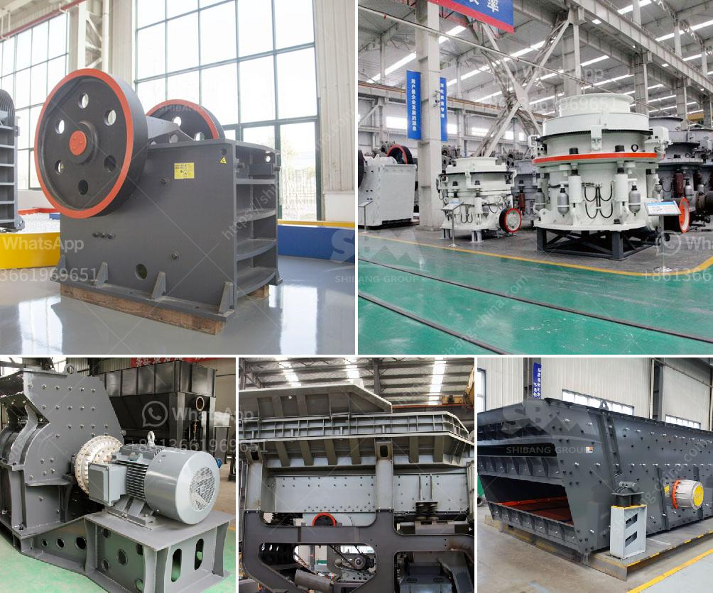

<h3>used small rotary kiln price russia</h3>
The used small rotary kiln price in Russia is essentially a derivative of the price of new kilns available in the market. The range of prices for new kilns spans a wide spectrum depending on the specifications and sizes of the kilns. The price of a small rotary kiln will be about 300,000 to 500,000 USD, which might sound like a significant amount of money. However, considering the potential benefits, it is well worth the investment.

A rotary kiln is a cylindrical vessel, which is inclined and slightly tilted from the horizontal axis. The raw material is fed into the kiln at the upper end and is gradually heated as it moves down towards the lower end, where it is discharged. Rotary kilns are primarily used in the production of cement, lime, calcination of minerals, and other thermal processing applications.

The small rotary kiln is a versatile piece of equipment that can be installed in industries ranging from cement plants to chemical plants. It is an ideal solution for small-scale production, as it requires less space and can be easily integrated into existing production lines. Additionally, the small size of the kiln ensures better energy efficiency and reduces operational costs.

One of the significant advantages of investing in a used small rotary kiln in Russia is the cost savings. A used kiln can offer substantial savings compared to purchasing a new one. The price, on average, can be nearly 30-50% less than the price of a new kiln. This cost reduction can have a significant impact on the overall project budget, especially for companies with limited financial resources.

In addition to cost savings, buying a used kiln offers several other advantages. Firstly, the lead time for delivery is significantly reduced, as the kiln is readily available for immediate installation. This can accelerate the project timeline and ensure a quicker return on investment. Secondly, used kilns typically have a shorter commissioning period, as they have already been tested and operated before. This results in a more streamlined start-up process and minimizes potential operational hiccups.

However, before purchasing a used rotary kiln, it is crucial to carefully evaluate the condition of the equipment. Thorough inspections and tests should be conducted to ensure that the kiln's structural integrity and operational efficiency are intact. It is also essential to consider the kiln's maintenance history, as regular maintenance can significantly extend the equipment's lifespan.

To conclude, the used small rotary kiln price in Russia offers companies a cost-effective solution to meet their thermal processing needs. With substantial cost savings compared to new kilns, quicker delivery, and commissioning timelines, investing in a used kiln can be a smart choice for companies looking to optimize their production processes. However, it is critical to perform due diligence and assess the condition of the kiln to ensure its reliability and long-term performance.
<h3>Contact us</h3><ul><li><strong>Whatsapp:&nbsp;<a href="https://wa.me/8613661969651">+8613661969651</a></strong></li><li><a href="https://swt.shibang-china.com/?git&amp;zhl&amp;used small rotary kiln price russia"><strong>Online Service(chat now)</strong></a></li></ul><h3>Related</h3><ul><li><a href='hp series cone crusher.md'>hp series cone crusher</a></li><li><a href='marble crushing machinery.md'>marble crushing machinery</a></li><li><a href='limestone crusher for sale.md'>limestone crusher for sale</a></li><li><a href='ultra conveyor belts usa.md'>ultra conveyor belts usa</a></li><li><a href='roller mill nigeria.md'>roller mill nigeria</a></li></ul>