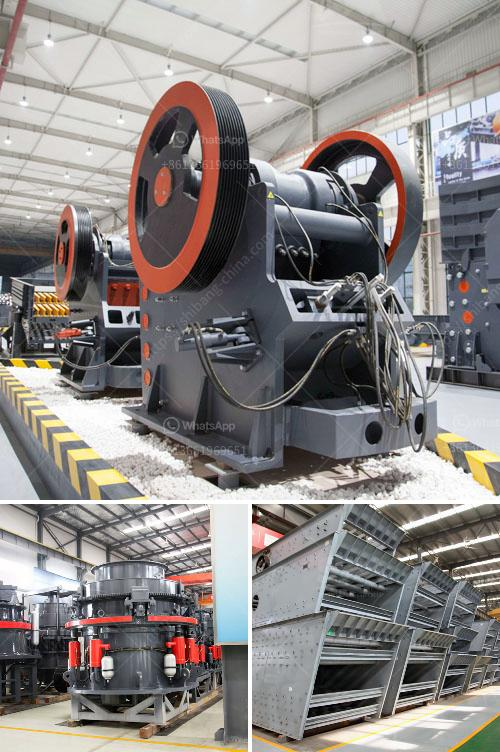

<h3>used stone crusher in europe for sale</h3>
Stone crusher in Europe is widely used in mining, smelting, building materials, highway, railway, water conservancy and chemical industry and many other sectors. Europe used stone crusher machine for sale are designed with high production technology and advanced technology. The used stone crusher in Europe for sale not only improves the production capacity and crushing efficiency, but also broadens the application ranges, from limestone to basalt, from stone production to various ore crushing, and makes it have multiple functions in various fields.

In Europe, the sale of used stone crusher machines is popular as well as the stones in Europe have different hardness and water content. For processing the used stone crusher machines, they have different factors that affect their working efficiency. Different types of machines have different prices, so users can choose a suitable one according to their own production needs.

The used stone crusher in Europe for sale equipment is mainly composed of two parts: vibrating feeder and crusher. The vibrating feeder supplies the materials to the jaw crusher for primary crushing. Afterwards, the material will be transported to the impact crusher or cone crusher by belt conveyor for secondary crushing. The crushed materials will be sieved by vibrating screen to get the required final products.

Europe used stone crusher machine for sale machines have widely applications and they are mainly used to crush large stones into small size. The crushed stone material for construction, road, bridge, buildings and other fields will be used for various uses. Crushed stone has many advantages, such as reduced bearing capacity, good adhesion and friction resistance, durability, wear resistance, etc. It can be used for construction, railway, highway, water conservancy, airport, port, wharf and other projects.

The used stone crusher in Europe for sale crushing machine produced by SBM has the advantages of compact structure, stable performance and high productivity. With the automatic control system, it can realize remote operation and can be used to adjust the size of the discharge port easily. The wear-resistant and easy to replace parts greatly extend the service life of the machine. The stone production line is featured with high degree of automation, low running costs, high crushing rate, energy saving and environmental protection.

In conclusion, Europe used stone crusher machine for sale is mainly designed to produce the building materials and provide the necessary raw materials for infrastructure construction. The stone crusher machines in Europe for sale are widely used in various industries, such as mining, smelting,building materials, highway, railway, water conservancy and chemical industry. It is also used to produce machine-made sand, concrete aggregate, asphalt concrete and cement concrete for construction engineering. The rapid economic development in Europe will drive the demand for used stone crusher machines, and we will have a bright future in the stone crusher industry.
<h3>Contact us</h3><ul><li><strong>Whatsapp:&nbsp;<a href="https://wa.me/8613661969651">+8613661969651</a></strong></li><li><a href="https://swt.shibang-china.com/?git&amp;zhl&amp;used stone crusher in europe for sale"><strong>Online Service(chat now)</strong></a></li></ul><h3>Related</h3><ul><li><a href='quartz stone crushing unit in india.md'>quartz stone crushing unit in india</a></li><li><a href='complete rock crusher machine prices in pakistan.md'>complete rock crusher machine prices in pakistan</a></li><li><a href='barite powder production process.md'>barite powder production process</a></li><li><a href='artificial sand project.md'>artificial sand project</a></li><li><a href='ton per hour stone crusher plant.md'>ton per hour stone crusher plant</a></li></ul>