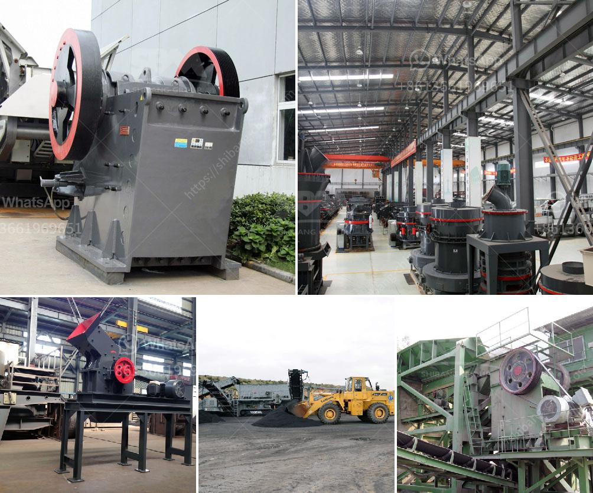

<h3>used stone crusher sale in ethiopia</h3>
Stone crushing industry is an important industrial sector in Ethiopia. The crushed stone is widely used in various fields of building construction, cement, highway and other industries. The development of Ethiopia stone processing requires a trusted crusher production enterprise. SBM is a trusted stone crushing plant supplier in China and we are able to provide the sophisticated high quality machines for stone crushing plant in Ethiopia.

Our 50-800tph stone crushing plant mainly include vibrating feeder, jaw crusher, impact crusher, circular vibrating screen and belt conveyor and so on. This is a complete crushing production line process, which can be used in artificial sand making to crush tough components. No matter what your stone material is, such as limestone, granite, basalt, river pebbles, metallurgical slag, slag, cement clinker, quartzite, iron ore, or other stone debris, we can manufacture the ideal equipment for you.

There are numerous stone crusher suppliers in Ethiopia. However, SBM is a leading supplier of equipment and services to the global mining and construction industry. We can help you solve the stone crushers problems and setup plants with our engineers excelling at providing technical guidance, installation, commissioning and training.

The growing number of construction projects in Ethiopia has increased employment opportunities for stone crusher industry. The demand for stone crusher will continue to grow with the growth of its user industry. The unit can be set up depending availability of raw material and major commercial center.

Used stone crusher for sale in Ethiopia is an ideal machine to handle and process stones in the mining industry. It can be used directly on the stone site to ensure that its size meets the required specifications and is capable of crushing work efficiently.

The need for high mobility and higher crushing capacities as compared to stationary crushing plants lead to the development of the crushers for sale in Ethiopia. For example, the jaw crushers are used for crushing stones with a compression strength that is considered to be less than 320 MPa. One of the gyratory crushers methods uses the pressing action of the crushing cone that impacts on the stone and breaks it apart into smaller pieces. Less abrasive stones and minerals can also be processed in the gyratory crushers.

The stone in the construction and road sector requires having a particle size of the material to different standards, including sand for building and decorative stones. The demand for crusher equipment is also expanding. SBM machinery is a professional stone crusher machine manufacturer in China and we can provide customers the preferred equipment used in stone crushing industry.

We provide 300-500tph stone crushing plant for sale in Ethiopia with low price. SBM will help you make high profits with low cost. Our 300-500tph stone crushing plant mainly include vibrating feeder, jaw crusher, impact crusher, circular vibrating screen and belt conveyor and so on. This is a complete crushing production line process, which can be used in artificial sand making to crush tough composites. Our 300-500tph stone crushing plant is mainly designed for medium scale stone quarrying plant, aggregate plant, mineral beneficiation plant and so on. It is the ideal equipment for construction waste recycling plant.

Overall, the used stone crusher sale in Ethiopia is very important for contractors, mineworkers and investors in Ethiopia. It is an ideal choice for crushing plant operations with high output, low energy consumption and durable wearing parts. Stone crusher has mobile crusher, portable crusher and stationary crusher according to its mobility. Mobile crusher is also called portable crusher, which is usually divided into crawler mobile crusher and rubber tyred mobile crusher. The models of mobile crusher include YG938E69, YG1142E710, YG1349E912 and YG1349EW86 and so on. If you need more detailed information, you can directly contact online customer service for prompt response!
<h3>Contact us</h3><ul><li><strong>Whatsapp:&nbsp;<a href="https://wa.me/8613661969651">+8613661969651</a></strong></li><li><a href="https://swt.shibang-china.com/?git&amp;zhl&amp;used stone crusher sale in ethiopia"><strong>Online Service(chat now)</strong></a></li></ul><h3>Related</h3><ul><li><a href='minerals separation and concentration plant in nigeria.md'>minerals separation and concentration plant in nigeria</a></li><li><a href='quartz stone making process.md'>quartz stone making process</a></li><li><a href='processing plan for feldspar ore.md'>processing plan for feldspar ore</a></li><li><a href='technical specification for ball mill.md'>technical specification for ball mill</a></li><li><a href='vertical grinding machine for foundry.md'>vertical grinding machine for foundry</a></li></ul>