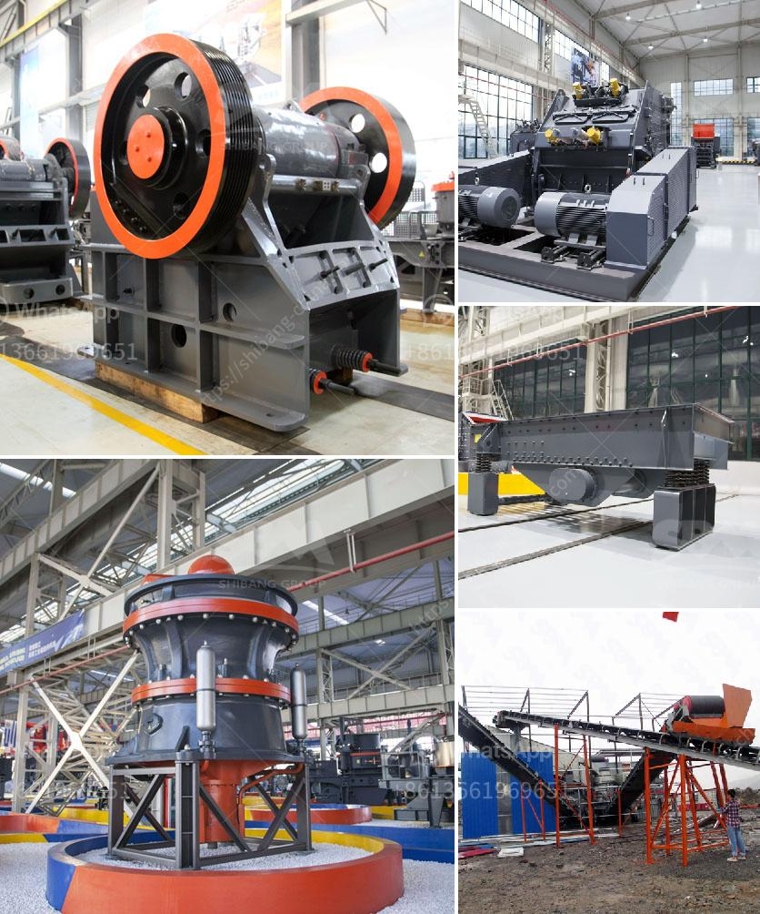

<h3>used stone crushers for sale india</h3>
Construction industry in India is growing at a rapid pace and with this the demand for manufactured sand (M-Sand) is skyrocketing. Sand is an essential component in concrete and is widely used for various construction purposes. The rising need for sand has led to the increase in illegal sand mining and depletion of natural resources. To address these concerns, the government and construction industry have now turned towards manufactured sand. 

Manufactured sand is produced from crushing rocks, quarry stones or larger aggregates into specific sizes. In India, this process is widely carried out by stone crushers. According to the Indian Construction and Mining Industry, during 2019-2020, over 2,500 stone crushers were operative across the country. Despite the rising demand for manufactured sand, several stone crushers owners are reluctant to shift to manufactured sand due to their concerns about uncertain profit margins, lack of skilled labor, environmental hazards, etc.

However, the scenario is gradually changing, and more stone crushers are now looking towards the used stone crusher market for options. Existing stone crushers are unable to meet the growing demand of required aggregate (M-sand) requirements. To meet the customers' needs, stone crusher manufacturers are investing in a new technology, including the use of robots and drones, thus reducing the labor cost and speeding up the process. This article provides an overview of the top manufacturers of used stone crushers for sale in India.

Developments in technology have changed the landscape of the construction industry. Traditional methods of construction are being replaced with modern techniques, and this has led to an increase in the demand for reliable and efficient stone crushers. With the development of new construction methods and techniques, the demand for used stone crushers is steadily growing. 

The increasing investment in the construction industry will drive the growth of the stone crushers market in India. New and used stone crushers are offered for sale on W-equipment.com For information to buy or selling a second hand stone crusher, you can quickly and easily to contact with the supplier of stone crushers and stone crusher spare parts. If you are looking for a used stone crusher, spare parts or related machinery and equipment, then this site is the most suitable.

The Indian government has initiated various infrastructure projects and schemes such as Pradhan Mantri Gram Sadak Yojana (PMGSY), Atal Mission for Rejuvenation and Urban Transformation (AMRUT), Smart Cities Mission, etc. These initiatives have led to a surge in the demand for construction materials, including manufactured sand. Therefore, the stone crusher market is expected to have a positive impact in the coming years.

With the rise in population, urbanization, industrialization, and the need for better transportation systems, there is a constant increase in the demand for infrastructure. This demand has led to the need for more stone crushers, thus propelling the used stone crushers market in India.

The construction industry contributes significantly to the GDP of India and is also a crucial driver of economic growth. With the increasing demand for sand and stone aggregates, the construction industry is expected to grow further and contribute even more to the Indian economy.

Stone crushers are widely used in the Indian construction industry and are an essential component for generating manufactured sand. With the increasing demand for stone aggregates in the construction industry, the sales of used stone crushers have increased significantly in recent years. The rising prices of the crushers and the extensive use of the machine in construction sites make it an attractive option for environmentally conscious buyers.
<h3>Contact us</h3><ul><li><strong>Whatsapp:&nbsp;<a href="https://wa.me/8613661969651">+8613661969651</a></strong></li><li><a href="https://swt.shibang-china.com/?git&amp;zhl&amp;used stone crushers for sale india"><strong>Online Service(chat now)</strong></a></li></ul><h3>Related</h3><ul><li><a href='small scale mobile sand and stone crushers.md'>small scale mobile sand and stone crushers</a></li><li><a href='silica quartz powder processing.md'>silica quartz powder processing</a></li><li><a href='stone crusher machine size 100 x 100 cm.md'>stone crusher machine size 100 x 100 cm</a></li><li><a href='conveyor belts for shelves.md'>conveyor belts for shelves</a></li><li><a href='silica sand mines in maharashtra.md'>silica sand mines in maharashtra</a></li></ul>