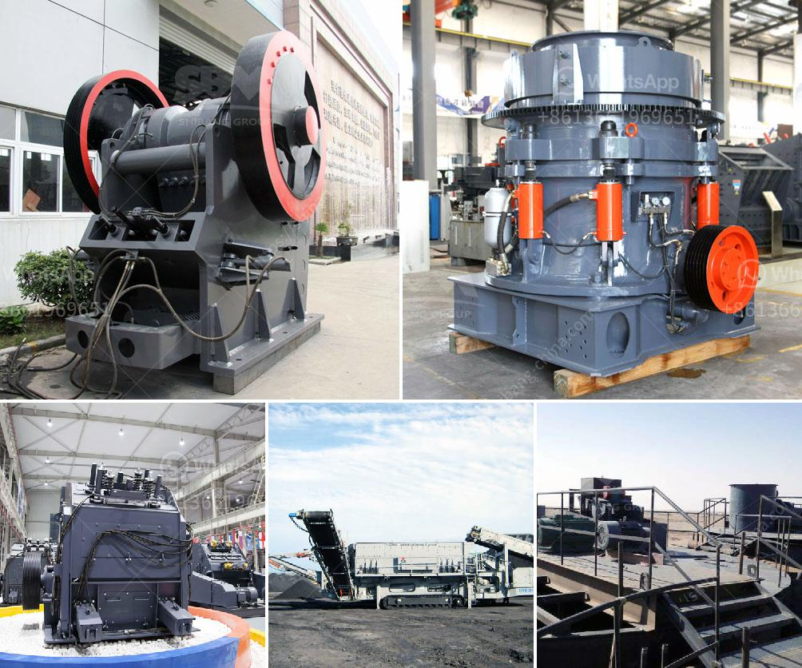

<h3>used stone crushers from japan for sale</h3>
Japan is a highly industrialized nation that has experienced several natural disasters throughout its history. These events have led to a high demand for used stone crushers from Japan for both residential and commercial purposes. These crushers are highly efficient and can be easily transported from one location to another, making them ideal for construction projects of all sizes.

One of the main advantages of purchasing used stone crushers from Japan is the relatively low cost. This is because these crushers have already been used and are being sold at a reduced price compared to brand new ones. As a result, buyers can save a significant amount of money, especially when purchasing in bulk. Additionally, since Japan is known for its high-quality engineering and craftsmanship, buyers can rest assured that the used stone crushers they purchase will still be in good working condition.

Furthermore, the availability of a wide range of used stone crushers from Japan ensures that buyers can easily find a crusher that meets their specific needs and preferences. These crushers come in various sizes, styles, and designs, allowing for customization to suit different project requirements. Whether it's for crushing large boulders into smaller stones or for breaking down concrete debris, there is a used stone crusher for every application.

Additionally, the used stone crushers from Japan are highly versatile and can be used in a variety of industries. Apart from construction, these crushers can also be used in mining, quarrying, and recycling operations. Many buyers have found that these crushers provide excellent returns on investment due to their durability and longevity.

In conclusion, the availability of used stone crushers from Japan offers numerous benefits to buyers. From cost savings and quality assurance to versatility and ease of transportation, these crushers are highly sought after in the market. Whether you are a construction company looking for affordable equipment or an individual in need of a high-quality crusher for personal use, exploring the range of used stone crushers from Japan is sure to yield satisfactory results.
<h3>Contact us</h3><ul><li><strong>Whatsapp:&nbsp;<a href="https://wa.me/8613661969651">+8613661969651</a></strong></li><li><a href="https://swt.shibang-china.com/?git&amp;zhl&amp;used stone crushers from japan for sale"><strong>Online Service(chat now)</strong></a></li></ul><h3>Related</h3><ul><li><a href='cost of building calcium carbonate factory.md'>cost of building calcium carbonate factory</a></li><li><a href='komatsu mobile crushers price.md'>komatsu mobile crushers price</a></li><li><a href='price of portable stonecrusher.md'>price of portable stonecrusher</a></li><li><a href='vibrating screen in egypt.md'>vibrating screen in egypt</a></li><li><a href='stone crusher machine sale in zambia.md'>stone crusher machine sale in zambia</a></li></ul>