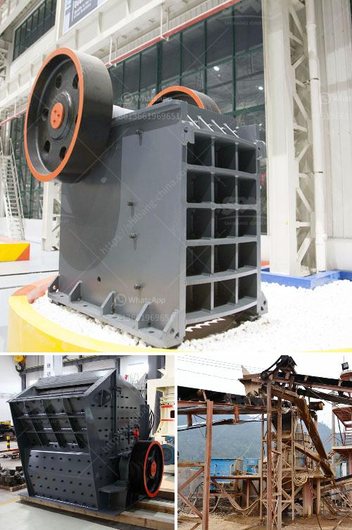

<h3>used ultra fine wet grinding mill gold ore</h3>
Gold mining is a crucial industry in many countries, contributing heavily to the global economy. As gold ore is extracted, the traditional method of grinding is typically carried out using large-scale processing plants, which require substantial investment. The advent of ultra fine wet grinding mills has brought a cost-effective solution to this challenging task.

Ultra fine wet grinding mills are designed to efficiently process small particles of gold ore into fine particles which are then sent to further leaching operations. These mills utilize high rotational speeds and grinding media such as steel balls or ceramic beads to break down the ore into smaller particles. The particles are then suspended in a liquid, usually water, to form a slurry, which can be easily processed and transported.

The advantages of using ultra fine wet grinding mills for gold ore are numerous. Firstly, the process is more efficient, reducing the amount of energy required compared to traditional dry grinding methods. This translates into lower operational costs, making it a financially viable option for smaller-scale mining operations.

Secondly, the use of water in the grinding process helps to control dust emissions, improving working conditions and reducing environmental impact. Dry grinding processes often generate a significant amount of airborne dust, which can be harmful to both workers and the surrounding environment. The slurrying effect of wet grinding mitigates this issue, resulting in a safer and more sustainable operation.

Furthermore, ultra fine wet grinding mills are highly customizable, allowing for specific adjustments to optimize the process for different ore types and conditions. The ability to fine-tune the grinding parameters, such as rotational speed, grinding media type, and slurry density, ensures optimal particle size reduction and maximum gold recovery.

In addition to these benefits, ultra fine wet grinding mills also offer improved control over the final product's particle size distribution. This is crucial in gold ore processing, as the extraction of gold often relies on the liberation of the metal from the ore matrix. Fine-tuning the particle size enables better recovery and extraction rates, ultimately maximizing the overall yield of gold.

Used ultra fine wet grinding mills can provide an affordable alternative for those looking to optimize their gold ore processing operations. By purchasing pre-owned equipment, mining companies can significantly reduce their initial investment costs without compromising on performance or efficiency. The market for used equipment is constantly evolving, providing a wide range of options to suit various budget constraints and operational requirements.

In conclusion, the use of ultra fine wet grinding mills for gold ore processing offers a cost-effective and sustainable solution for the mining industry. The ability to reduce operational costs, control dust emissions, and optimize the particle size distribution of the final product makes these mills a valuable asset for gold mining operations worldwide. With the option of purchasing used equipment, mining companies can achieve significant savings while still benefiting from the latest advancements in grinding technology.
<h3>Contact us</h3><ul><li><strong>Whatsapp:&nbsp;<a href="https://wa.me/8613661969651">+8613661969651</a></strong></li><li><a href="https://swt.shibang-china.com/?git&amp;zhl&amp;used ultra fine wet grinding mill gold ore"><strong>Online Service(chat now)</strong></a></li></ul><h3>Related</h3><ul><li><a href='small crushers for sale.md'>small crushers for sale</a></li><li><a href='slag grinderr capling.md'>slag grinderr capling</a></li><li><a href='quartz crushing plant for engineered stone.md'>quartz crushing plant for engineered stone</a></li><li><a href='crusher and producton per hour.md'>crusher and producton per hour</a></li><li><a href='malaysia conveyor belts price.md'>malaysia conveyor belts price</a></li></ul>