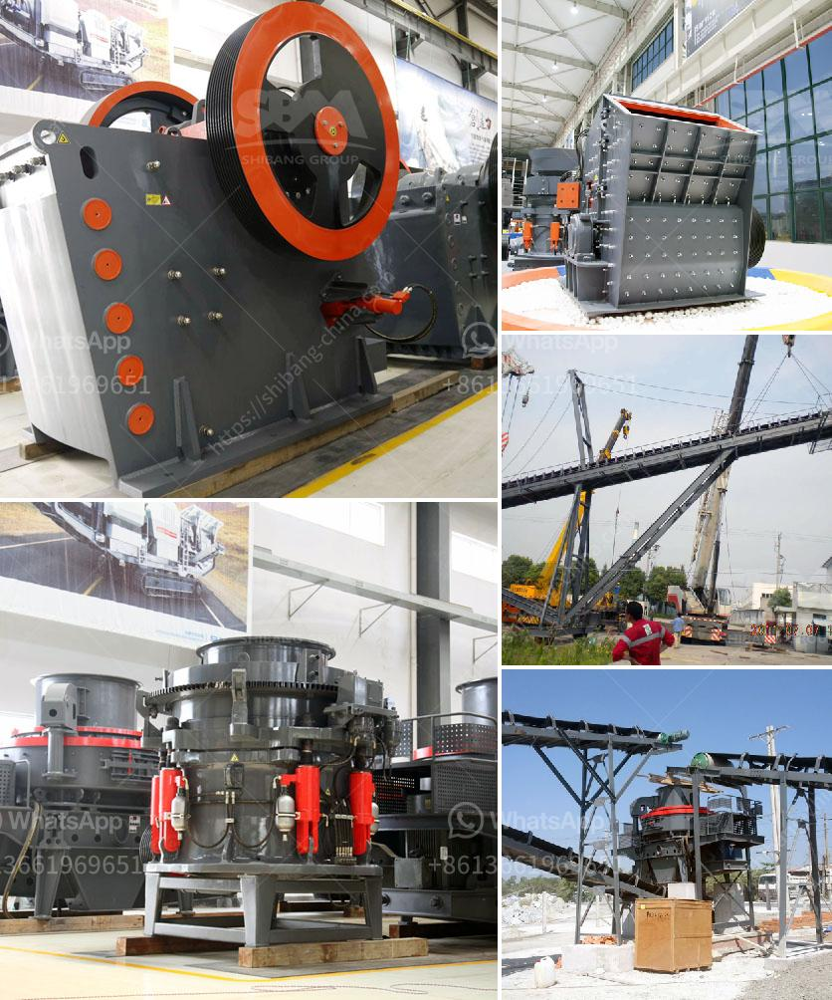

<h3>used vibro screener for sale</h3>
If you are in the market for a vibro screener but have a limited budget, opting for a used vibro screener for sale can be a practical and cost-effective solution. Vibro screeners, also known as vibrating screeners, are versatile machines widely used in various industries for separating and grading bulk materials. These machines offer numerous benefits, and purchasing a used one allows you to enjoy those advantages without breaking the bank.

There are several reasons why buying a used vibro screener is a smart decision. First and foremost, it allows you to save a significant amount of money. Used machines are typically sold at a fraction of the cost of new ones, making it an attractive option for businesses looking to reduce their expenses. By opting for a used vibro screener, you can allocate your saved funds towards other crucial aspects of your operation, such as product development or marketing efforts.

Furthermore, used vibro screeners for sale often come with added benefits such as strong market credibility. These machines have already proven their efficiency and reliability by being in use. Therefore, you can have confidence in their performance and durability. Additionally, buying a used screener from a reputable seller ensures that you receive a machine that has been properly maintained and serviced, ensuring its good working condition.

When purchasing a used vibro screener, there are a few key factors to consider to ensure that you make a wise investment. Firstly, assess your specific needs and requirements. Consider the size, capacity, and screening capabilities that are necessary for your business. Research various models and brands to find the one that best suits your applications. Secondly, thoroughly inspect the machine before finalizing the purchase. Look for signs of wear and tear, any broken or missing parts, and ensure that all components are functioning correctly. It may be wise to seek out the advice of a professional to assist in the inspection process.

It is also essential to obtain a thorough understanding of the machine's history. Inquire about the screeners' usage patterns, previous maintenance records, and any repairs that may have been conducted. This information can help you determine the machine's remaining lifespan and potential operating costs. Additionally, ask about the seller's warranty or guarantee policies to ensure that you have adequate support in case of any issues that may arise.

To find a used vibro screener for sale, explore various resources such as online marketplaces, classified ads, and machinery auctions. These platforms provide access to a wide range of machines and sellers, increasing your chances of finding a suitable option that meets your requirements and budget.

In conclusion, buying a used vibro screener for sale is an excellent choice for businesses looking to acquire this versatile machine at a lower cost. With proper research and inspection, you can find a high-quality machine that meets your specific needs and offers long-term value. Embrace the opportunity to save money while still enjoying the benefits of efficient material separation and grading with a used vibro screener.
<h3>Contact us</h3><ul><li><strong>Whatsapp:&nbsp;<a href="https://wa.me/8613661969651">+8613661969651</a></strong></li><li><a href="https://swt.shibang-china.com/?git&amp;zhl&amp;used vibro screener for sale"><strong>Online Service(chat now)</strong></a></li></ul><h3>Related</h3><ul><li><a href='quarry business plan sample.md'>quarry business plan sample</a></li><li><a href='concrete batching plant for sale.md'>concrete batching plant for sale</a></li><li><a href='stone mill grinder price.md'>stone mill grinder price</a></li><li><a href='used machine hammer mill.md'>used machine hammer mill</a></li><li><a href='silica sand washing and grinding.md'>silica sand washing and grinding</a></li></ul>