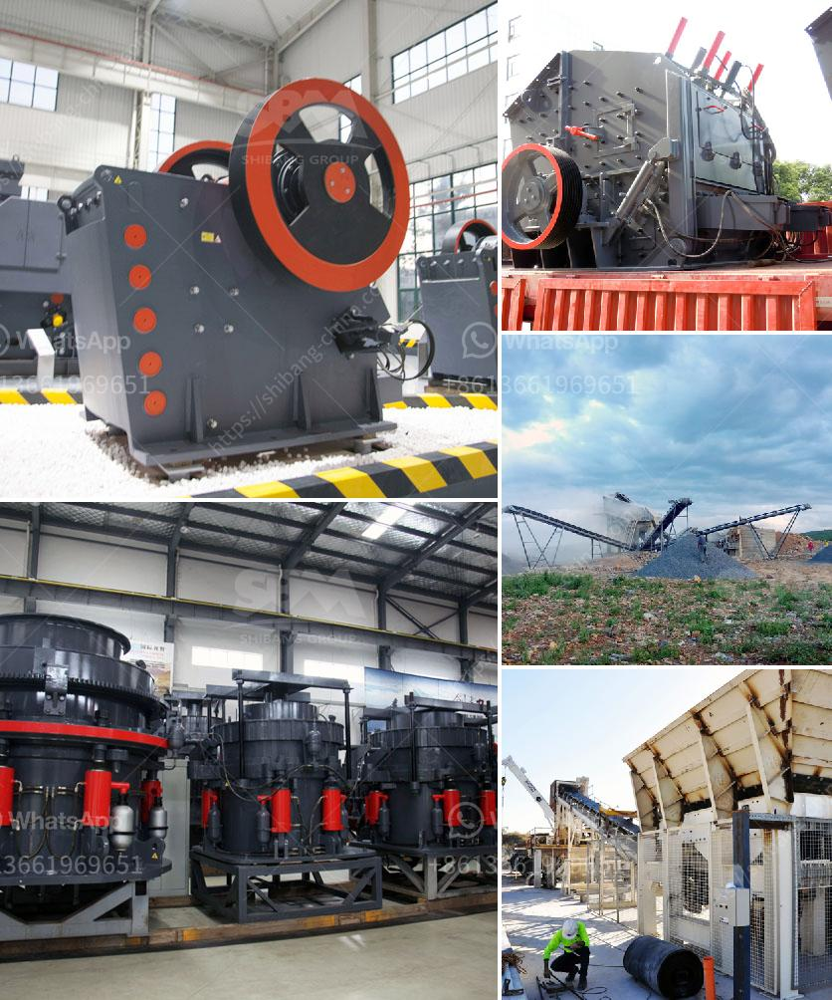

<h3>usine carbonate de calcium</h3>
Calcium carbonate is a versatile compound that finds its uses in various industries due to its unique properties. Also known as limestone, chalk, or marble, calcium carbonate is widely used in manufacturing processes and as a key ingredient in many products. It plays a vital role in industries ranging from construction and agriculture to healthcare and food production.

One of the major applications of calcium carbonate is in the construction industry. It is used as a raw material in the production of cement and concrete. Calcium carbonate acts as a binder that holds the aggregates together, providing stability and strength to the structure. It is also added to mortars and plasters to improve their workability and durability. Additionally, it is used as a filler in paints and coatings, helping them adhere to the surface, preventing corrosion, and enhancing the overall finish.

Another significant use of calcium carbonate is in agriculture. It is employed as a soil amendment to neutralize acidic soils and regulate pH levels. Calcium carbonate helps in improving soil structure, enhancing water and nutrient retention, and promoting healthy plant growth. It also acts as a calcium supplement for animals and is incorporated into animal feeds to support bone development and overall health.

The healthcare industry relies heavily on calcium carbonate for various applications. It is commonly used as a dietary supplement due to its high calcium content. Calcium carbonate supplements are prescribed to individuals with calcium deficiencies, including pregnant women and individuals with osteoporosis. It is also an essential ingredient in antacids, where it helps in neutralizing excess stomach acid and providing relief from heartburn and indigestion.

Additionally, calcium carbonate is widely used in the production of paper and cardboard. It acts as a filler, improving the paper's opacity, brightness, and printability. By incorporating calcium carbonate into the paper manufacturing process, the consumption of wood fibers can be reduced, making it an eco-friendly choice.

In the food industry, calcium carbonate is commonly added as a food additive. It acts as an anti-caking agent, preventing ingredients from clumping. It can also be used as a calcium fortifier in various food products, such as milk alternatives, breakfast cereals, and baked goods. Moreover, it is employed as a buffering agent in the beverage industry, helping to maintain the desired pH levels.

In conclusion, calcium carbonate is a versatile compound with numerous applications across various industries. Its unique properties make it an indispensable ingredient in construction, agriculture, healthcare, paper production, and food industries. From providing strength and stability to structures in construction to promoting healthy plant growth in agriculture, calcium carbonate plays a pivotal role in enhancing various processes. With its wide-ranging applications and benefits, calcium carbonate continues to be a valuable resource for numerous industries.
<h3>Contact us</h3><ul><li><strong>Whatsapp:&nbsp;<a href="https://wa.me/8613661969651">+8613661969651</a></strong></li><li><a href="https://swt.shibang-china.com/?git&amp;zhl&amp;usine carbonate de calcium"><strong>Online Service(chat now)</strong></a></li></ul><h3>Related</h3><ul><li><a href='germany calcium carbonate grinding mill suppliers.md'>germany calcium carbonate grinding mill suppliers</a></li><li><a href='starting up a small scale gold mine in zimbabwe.md'>starting up a small scale gold mine in zimbabwe</a></li><li><a href='used ball mills for sale.md'>used ball mills for sale</a></li><li><a href='vertical ball mills of india.md'>vertical ball mills of india</a></li><li><a href='principle of cone crusher.md'>principle of cone crusher</a></li></ul>