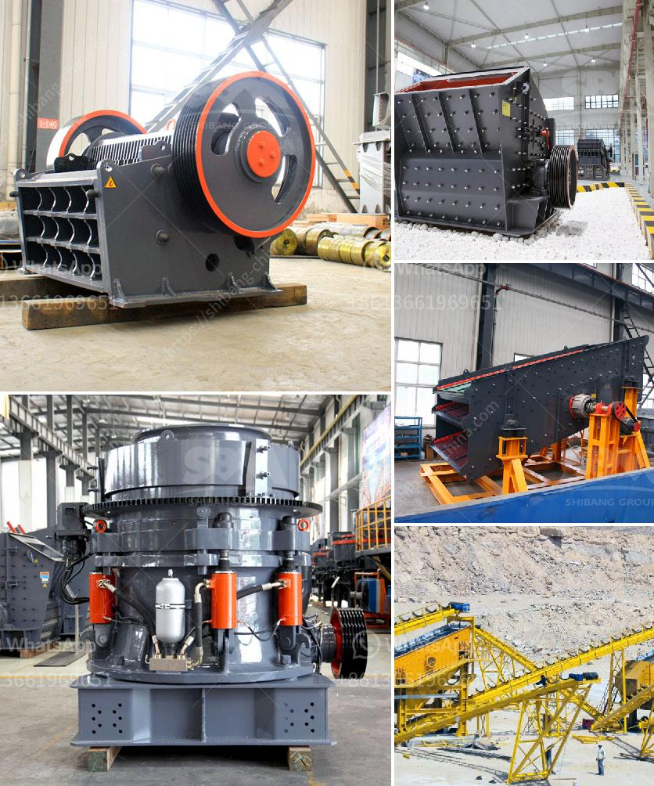

<h3>vertical ball mill technology</h3>
Vertical ball mill technology has been successfully applied in various industries such as mining, building materials, chemical, metallurgy, and environmental protection, due to its excellent performance. The vertical ball mill has been widely used in the grinding and comminution of raw materials in the cement industry, and is suitable for large-scale grinding production.

One of the key advantages of vertical ball mills is their versatility. With a wide range of applications, they are suitable for grinding various raw materials and finished products. Vertical ball mills can grind and disperse a variety of materials, including ores, minerals, paint pigments, ink, and coatings. This makes them an ideal choice for a wide range of industries.

Another advantage of vertical ball mills is their energy efficiency. Compared to traditional ball mills, the energy consumption is lower, which reduces operating costs and makes the vertical ball mill more environmentally friendly. This is achieved through the unique design of the vertical ball mill, which provides a larger grinding surface area and allows for more effective grinding and dispersing of materials.

The vertical ball mill also has a smaller footprint compared to traditional ball mills, which makes it an ideal choice for small-scale grinding applications. The vertical ball mill has a compact design and takes up less space in the grinding workshop. It also has a lower height, which means it is easier to install and maintain.

In addition to these advantages, the vertical ball mill also has a higher grinding efficiency. This means that it can produce finer particles and achieve a higher degree of comminution compared to traditional ball mills. The vertical ball mill uses the principle of impact and attrition to grind the material, ensuring that the desired particle size is achieved. This is particularly important in industries such as cement, where the fineness of the final product is crucial.

Furthermore, the vertical ball mill offers better control over the grinding process. The mill speed and load can be adjusted to optimize the grinding performance, ensuring that the desired level of fineness is achieved. This level of control is important in industries where consistency and quality are of utmost importance.

In conclusion, vertical ball mill technology offers several advantages over traditional ball mills. Its versatility, energy efficiency, smaller footprint, and higher grinding efficiency make it an ideal choice for various industries. Whether it is grinding raw materials in the cement industry or dispersing pigments in the paint industry, the vertical ball mill provides a reliable and efficient solution. As technology continues to advance, vertical ball mills are expected to play an even more significant role in the grinding and comminution processes.
<h3>Contact us</h3><ul><li><strong>Whatsapp:&nbsp;<a href="https://wa.me/8613661969651">+8613661969651</a></strong></li><li><a href="https://swt.shibang-china.com/?git&amp;zhl&amp;vertical ball mill technology"><strong>Online Service(chat now)</strong></a></li></ul><h3>Related</h3><ul><li><a href='ball mill grinder for sale.md'>ball mill grinder for sale</a></li><li><a href='jaw impact crusher poland.md'>jaw impact crusher poland</a></li><li><a href='aggregate production equipment.md'>aggregate production equipment</a></li><li><a href='used stone crusher in europe for sale.md'>used stone crusher in europe for sale</a></li><li><a href='komatsu mobile crushers price.md'>komatsu mobile crushers price</a></li></ul>