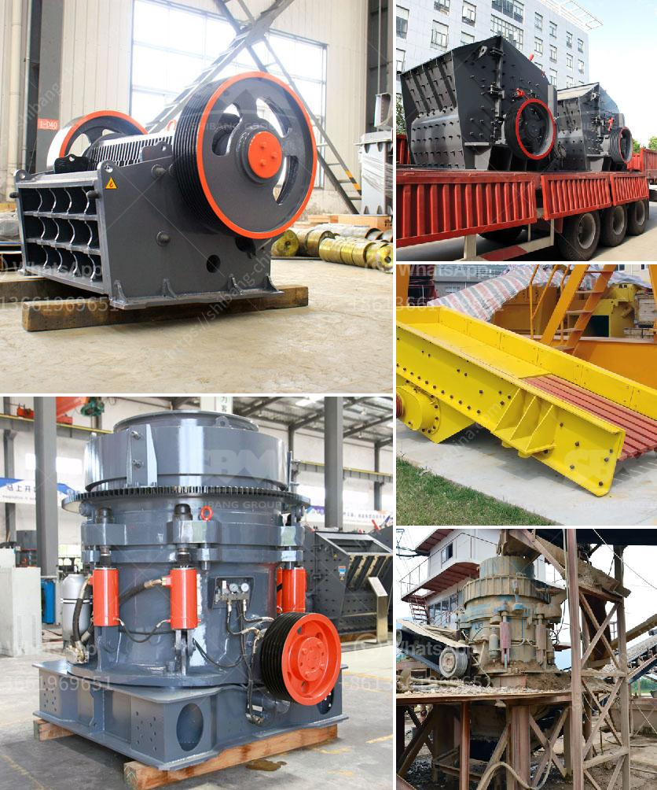

<h3>vertical ball mills of india</h3>
Vertical ball mills are a form of tumbling mills that are designed to blend materials, size reduction is executed by impacting the media cascading or cataracting and also attrition through the tumbling action. These mills have cylindrical structure and they can operate at various speeds, thus allowing for optimum grinding efficiency. However, the operating cost of a vertical ball mill is usually higher than that of a horizontal ball mill due to its complex structure and increased energy consumption.

In India, vertical ball mills have gained popularity over horizontal ball mills due to their increased efficiency and lower operating cost. Several manufacturers have lately introduced innovative designs and technologies to facilitate the production process and enhance the performance of these mills.

One such development in vertical ball mills is the classification system that is incorporated into the mill to ensure precise control of particle sizes. This system uses a rotating wheel with blades or vanes to separate the coarse particles from the fine ones. The coarse particles are returned to the grinding chamber for further size reduction, while the fine particles are discharged from the mill. This classification system improves the overall grinding efficiency of the mill by reducing the recirculation of oversized particles, thus preventing excessive energy consumption.

Another important feature of vertical ball mills in India is the use of advanced materials for the grinding media. Traditionally, grinding media in these mills were made of steel, which is prone to corrosion and wear. However, manufacturers have now started using high-quality ceramic or composite materials that offer superior performance and durability. These new materials not only reduce the rate of wear and tear but also minimize contamination of the final product, making them suitable for grinding sensitive materials such as chemicals and pharmaceuticals.

Furthermore, vertical ball mills in India are equipped with advanced control systems that allow for precise regulation of the grinding process. These systems monitor various parameters such as mill speed, feed rate, and temperature to optimize the grinding efficiency and prevent overheating or under grinding. The real-time data provided by these control systems enables operators to make informed decisions and adjust the process parameters accordingly.

In conclusion, vertical ball mills have become an integral part of the grinding process in India due to their efficiency and cost-effectiveness. The incorporation of classification systems, advanced materials for grinding media, and sophisticated control systems has further improved their performance and made them suitable for a wide range of applications. As the demand for high-quality products increases, manufacturers will continue to innovate and introduce new technologies to further enhance the capabilities of vertical ball mills in India.
<h3>Contact us</h3><ul><li><strong>Whatsapp:&nbsp;<a href="https://wa.me/8613661969651">+8613661969651</a></strong></li><li><a href="https://swt.shibang-china.com/?git&amp;zhl&amp;vertical ball mills of india"><strong>Online Service(chat now)</strong></a></li></ul><h3>Related</h3><ul><li><a href='cost of building calcium carbonate factory.md'>cost of building calcium carbonate factory</a></li><li><a href='50tph stone crusher in germany.md'>50tph stone crusher in germany</a></li><li><a href='jaw crusher in german.md'>jaw crusher in german</a></li><li><a href='german jaw crusher manufacturers.md'>german jaw crusher manufacturers</a></li><li><a href='hammer mill design plans pdf mtm crusher.md'>hammer mill design plans pdf mtm crusher</a></li></ul>