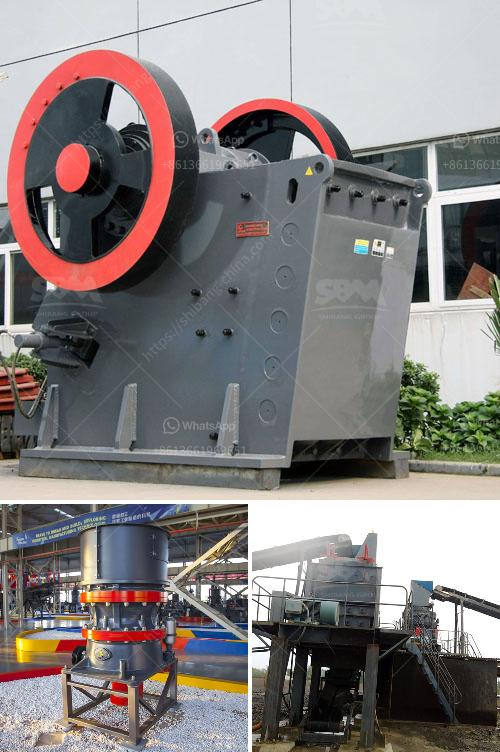

<h3>vertical grinding machine for foundry</h3>
Vertical grinding machines have revolutionized the foundry industry, offering precision grinding capabilities for a variety of metal parts. These machines offer numerous advantages over their horizontal counterparts, leading to increased efficiency and productivity in foundry operations.

Vertical grinding machines are specifically designed to grind parts with complex shapes and high precision requirements. These machines utilize vertical grinding wheels that rotate on a vertical axis, allowing for precise control and grinding of intricate contours and shapes. Unlike horizontal grinding machines, which require multiple setups and fixtures, vertical grinding machines can often complete the entire grinding process in a single setup, saving both time and resources.

One of the primary advantages of vertical grinding machines in foundry operations is their compact design. These machines have a smaller footprint compared to their horizontal counterparts, making them ideal for space-constrained foundry environments. With their smaller size, vertical grinding machines can be easily integrated into existing production lines, increasing the overall efficiency of the foundry.

Vertical grinding machines also offer improved ergonomic features compared to horizontal machines. Operators can easily access the workpiece from the front of the machine, simplifying loading and unloading operations. Additionally, vertical grinding machines often feature automated loading and unloading systems, further streamlining the grinding process and reducing operator fatigue.

Another significant advantage of vertical grinding machines for foundry applications is their ability to handle a wide range of materials. These machines can grind various metals commonly used in foundry operations, such as cast iron, steel, and aluminum. Their versatility makes them suitable for grinding both small and large parts, accommodating a wide range of foundry applications.

To maximize efficiency and productivity, many vertical grinding machines for foundry applications are equipped with advanced automation systems. These systems can automate the grinding process, reducing the need for manual intervention and ensuring consistent and precise results. Additionally, advanced control systems can monitor and adjust grinding parameters in real-time, optimizing the grinding process for maximum quality and productivity.

In conclusion, vertical grinding machines have transformed the foundry industry by offering precision grinding capabilities in a compact and versatile design. These machines streamline the grinding process, allowing for efficient and precise grinding of complex shapes and contours. Their compact size and improved ergonomics make them well-suited for space-constrained foundry environments, while automation features enhance productivity and quality. With their ability to handle a wide range of materials, vertical grinding machines have become an invaluable tool in modern foundry operations.
<h3>Contact us</h3><ul><li><strong>Whatsapp:&nbsp;<a href="https://wa.me/8613661969651">+8613661969651</a></strong></li><li><a href="https://swt.shibang-china.com/?git&amp;zhl&amp;vertical grinding machine for foundry"><strong>Online Service(chat now)</strong></a></li></ul><h3>Related</h3><ul><li><a href='germany rocks crushers.md'>germany rocks crushers</a></li><li><a href='jaw crusher project report pdf.md'>jaw crusher project report pdf</a></li><li><a href='silver copper cone crusher.md'>silver copper cone crusher</a></li><li><a href='difference between hp cone crusher.md'>difference between hp cone crusher</a></li><li><a href='crusher primary mobile crusher.md'>crusher primary mobile crusher</a></li></ul>