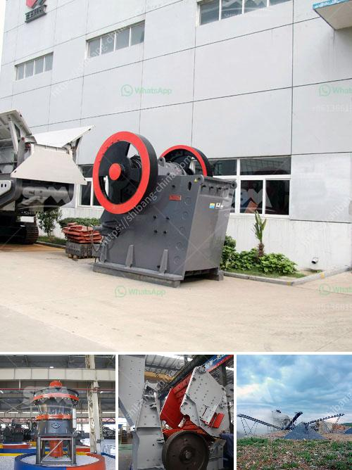

<h3>vertical grinding machine for marble</h3>
Marble has been a popular choice for aesthetics and versatility in many architectural and interior design applications. From exquisite sculptures to luxurious countertops, the demand for finely crafted marble products continues to grow. To meet this demand, manufacturers rely on advanced machinery, such as the vertical grinding machine, to achieve precise and efficient results.

A vertical grinding machine is a powerful tool that excels in delivering high-quality finishes for marbles. Its ability to shape and grind is unmatched, making it an essential equipment in marble processing facilities. The machine operates on a vertical axis, allowing the grinding wheel to be oriented at any angle, from horizontal to vertical. This flexibility provides greater control and accuracy during the grinding process, resulting in finely polished marble surfaces.

One of the primary advantages of the vertical grinding machine is its ability to remove material quickly and effectively. The machine is equipped with a grinding wheel that rotates at high speeds, and its vertical orientation allows for efficient material removal. As a result, manufacturers can achieve the desired shape and smoothness of the marble in a relatively short period, minimizing production time.

Moreover, the vertical grinding machine offers enhanced precision, ensuring consistent and uniform finishes across different marble surfaces. The machine's precise control over the grinding movement enables operators to adjust angles, depths, and pressure with utmost accuracy. This level of precision is crucial for achieving seamless transitions between different sections of a marble product and maintaining dimensional integrity throughout the grinding process.

Furthermore, the vertical grinding machine for marble is designed to be user-friendly, allowing operators with varying skill levels to operate it efficiently. The machine features intuitive controls, easily adjustable settings, and automated functions that simplify the grinding process. These user-friendly features not only contribute to the machine's efficiency but also reduce the risk of errors or mistakes during operation.

In conclusion, the vertical grinding machine for marble is an indispensable tool for manufacturers seeking precision and efficiency in marble processing. Its ability to shape, grind, and polish marble surfaces with speed and accuracy makes it a reliable choice for producing high-quality marble products. With its user-friendly features and enhanced precision, the vertical grinding machine ensures that every piece of marble meets the highest standards of craftsmanship.
<h3>Contact us</h3><ul><li><strong>Whatsapp:&nbsp;<a href="https://wa.me/8613661969651">+8613661969651</a></strong></li><li><a href="https://swt.shibang-china.com/?git&amp;zhl&amp;vertical grinding machine for marble"><strong>Online Service(chat now)</strong></a></li></ul><h3>Related</h3><ul><li><a href='iron ore loading grinding process plant.md'>iron ore loading grinding process plant</a></li><li><a href='roller mill nigeria.md'>roller mill nigeria</a></li><li><a href='crushed stone prices per ton.md'>crushed stone prices per ton</a></li><li><a href='processing plan for feldspar ore.md'>processing plan for feldspar ore</a></li><li><a href='ball mill unloading system in india.md'>ball mill unloading system in india</a></li></ul>