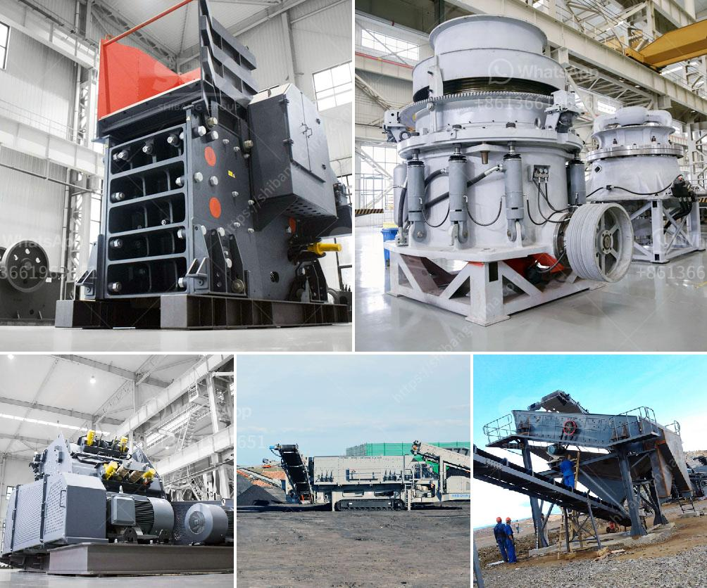

<h3>vertical impact crusher manufacturer in india</h3>
A vertical impact crusher, also known as a sand making machine, is a highly efficient crusher used to break down aggregate, gravel, and ore material into smaller pieces. This equipment is commonly used in various industries such as mining, metallurgy, building materials, highways, railways, water conservancy, and chemical industries.

In India, there are many manufacturers of vertical impact crushers, all of whom strive to provide high-quality products and excellent customer service. One such manufacturer is XYZ Company, a renowned name in the industry.

XYZ Company has been manufacturing vertical impact crushers for several years and has gained a solid reputation for their reliable and efficient machines. They have a team of skilled engineers and technicians who ensure that each machine is made with precision and meets international quality standards.

What sets XYZ Company apart from other manufacturers is their focus on innovation. They constantly strive to improve their products and incorporate new technologies into their crushers. This ensures that customers benefit from the latest advancements in the industry, resulting in higher productivity and reduced maintenance costs.

Furthermore, XYZ Company offers a wide range of vertical impact crushers to cater to various needs and requirements. Whether it is a small-scale project or a large construction site, they have a crusher that can handle the job efficiently. Their machines are also available in different capacities, allowing customers to choose the perfect crusher for their specific applications.

Apart from manufacturing vertical impact crushers, XYZ Company also provides excellent after-sales service. They have a team of experienced technicians who are always ready to assist customers with any queries or concerns they may have. This level of support ensures that customers have a smooth and hassle-free experience with their crushers.

In conclusion, XYZ Company is a leading manufacturer of vertical impact crushers in India. Their dedication to innovation, high-quality products, and excellent customer service sets them apart from the competition. If you are looking for a reliable and efficient vertical impact crusher, XYZ Company should be your go-to choice.
<h3>Contact us</h3><ul><li><strong>Whatsapp:&nbsp;<a href="https://wa.me/8613661969651">+8613661969651</a></strong></li><li><a href="https://swt.shibang-china.com/?git&amp;zhl&amp;vertical impact crusher manufacturer in india"><strong>Online Service(chat now)</strong></a></li></ul><h3>Related</h3><ul><li><a href='modular jaw crusher.md'>modular jaw crusher</a></li><li><a href='market analysis of stone crusher.md'>market analysis of stone crusher</a></li><li><a href='tons stationary impact granite crusher.md'>tons stationary impact granite crusher</a></li><li><a href='crusher machine in bhutan.md'>crusher machine in bhutan</a></li><li><a href='three roll mills supplier.md'>three roll mills supplier</a></li></ul>