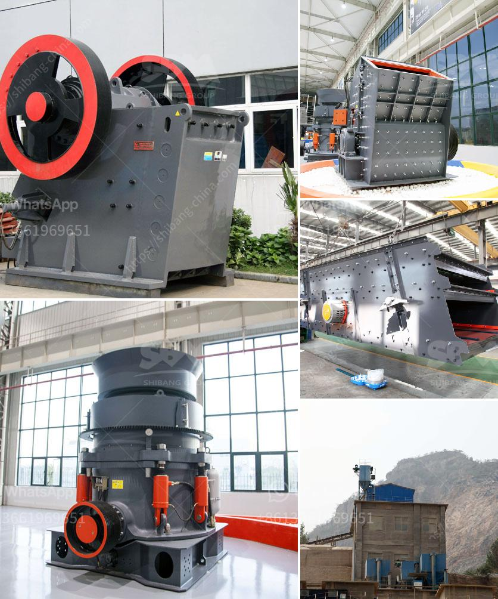

<h3>vertical mill of a cement company</h3>
Vertical mills are widely used in the cement industry for grinding cement raw material, clinker, granulated blast furnace slag, and limestone powder. As a leading cement plant manufacturer, XYZ Company offers a variety of vertical mills to suit specific grinding requirements.

1. High grinding efficiency: Vertical mills use the bed grinding principle to grind materials, which ensures that the grinding efficiency is maximized. It also reduces the tendency for over-grinding.

2. Low power consumption: The energy consumption of vertical mills is significantly lower compared to ball mills, which results in a lower cost of electricity.

3. Compact design: Vertical mills have a compact design, making them suitable for small or medium-sized cement plants. The compact design also allows for easy installation and maintenance.

4. Versatility: Vertical mills can be used for grinding a wide range of materials, including clinker, granulated blast furnace slag, and limestone powder. This versatility makes vertical mills a cost-effective solution for many cement producers.

5. Lower environmental impact: Vertical mills produce less noise, dust, and emissions compared to traditional ball mills. This reduces the environmental impact of the cement manufacturing process and improves the working conditions for operators.

XYZ Company's vertical mill is specifically designed for the cement industry, providing the following features:

1. High-quality grinding components: The vertical mill is equipped with high-quality grinding rollers and grinding table liners to ensure consistent and efficient grinding.

2. Advanced control system: XYZ Company's vertical mills are equipped with advanced control systems that allow for precise control of the grinding process. This ensures optimal grinding performance and product quality.

3. Reliable operation: The vertical mill is designed for reliable operation, with a robust and sturdy construction that can withstand the demanding conditions of the cement industry.

4. Easy maintenance: XYZ Company's vertical mills are designed for easy maintenance, with quick and easy access to all key components. This reduces downtime and ensures maximum productivity.

Vertical mills play a critical role in the cement industry, providing efficient grinding solutions for cement raw material, clinker, granulated blast furnace slag, and limestone powder. XYZ Company's vertical mill offers numerous advantages, including high grinding efficiency, low power consumption, compact design, versatility, and lower environmental impact.

By choosing XYZ Company's vertical mill, cement producers can benefit from improved grinding performance, reduced energy consumption, and lower operating costs. With its advanced control system and reliable operation, the vertical mill ensures consistent and high-quality grinding results. Additionally, the easy maintenance features of the mill contribute to increased productivity and reduced downtime. Overall, XYZ Company's vertical mill is an excellent choice for cement companies striving for enhanced grinding efficiency and sustainable operations.
<h3>Contact us</h3><ul><li><strong>Whatsapp:&nbsp;<a href="https://wa.me/8613661969651">+8613661969651</a></strong></li><li><a href="https://swt.shibang-china.com/?git&amp;zhl&amp;vertical mill of a cement company"><strong>Online Service(chat now)</strong></a></li></ul><h3>Related</h3><ul><li><a href='how to start stone crusher project.md'>how to start stone crusher project</a></li><li><a href='portable ballast crusher for sale.md'>portable ballast crusher for sale</a></li><li><a href='coal mill pulverizer.md'>coal mill pulverizer</a></li><li><a href='aggregates crusher plants in malaysia.md'>aggregates crusher plants in malaysia</a></li><li><a href='hammer mill 200 mesh.md'>hammer mill 200 mesh</a></li></ul>