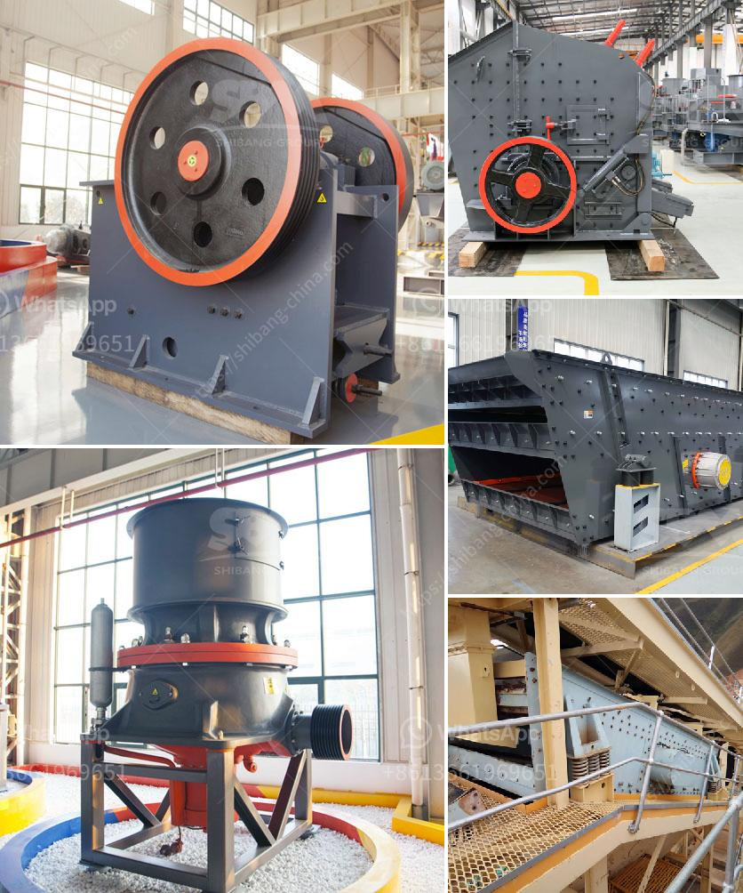

<h3>vertical roller mill for cement german</h3>
In the last century, the cement production industry has experienced significant advancements in technology, making it one of the most advanced sectors in the global manufacturing industry. The introduction of the vertical roller mill in the late 20th century revolutionized cement production in Germany and ultimately worldwide.

A VRM is a type of industrial equipment used to crush or grind materials into small particles. These machines consist of a large, rotating steel cylinder, known as a mill, which revolves around a central vertical axis. The grinding plate, located above the mill, is responsible for feeding materials into the mill and controlling the grinding process.

1. Energy Efficiency: One of the key advantages of using a VRM for cement grinding is its ability to save a significant amount of energy compared to traditional ball mills. This is primarily attributed to the vertical design of the mill, which ensures a larger contact area between the grinding media and the material being ground, resulting in more efficient grinding.

2. Enhanced Product Quality: German-engineered VRMs offer superior control over the particle size distribution of the final cement product. By closely monitoring and adjusting the operating parameters, such as grinding pressure and separator speed, they can produce cement with significantly higher fineness compared to conventional grinding methods. This not only improves the strength and durability of the final product but also enhances its workability.

3. Flexibility and Versatility: VRMs are highly versatile machines capable of accommodating various materials and applications. Besides cement grinding, they can be used for grinding other industrial minerals, raw materials for the production of alternative fuels, and even solid fuels such as coal, petcoke, and biomass. This adaptability allows cement manufacturers to optimize their production processes, reduce costs, and improve overall efficiency.

Germany has long been at the forefront of technological innovations in the cement industry, and the development of the vertical roller mill is no exception. Renowned German manufacturers such as Gebr. Pfeiffer, Loesche GmbH, and Thyssenkrupp Industrial Solutions have introduced highly advanced VRMs that have transformed cement production worldwide.

Gebr. Pfeiffer, in particular, has been a pioneer in the field, offering a wide range of VRMs suitable for various cement production needs. Their mills are equipped with state-of-the-art hydraulic systems that enable quick and easy roller changes, minimizing downtime and increasing overall plant availability.

The German-engineered vertical roller mill has revolutionized cement production worldwide, offering advantages such as energy efficiency, enhanced product quality, and flexibility in a highly competitive industry. As cement manufacturers continue to seek sustainable and efficient solutions, VRMs will undoubtedly play an even more crucial role in shaping the future of cement production, making it more environmentally friendly and economically viable. With ongoing research and development efforts, German manufacturers are committed to pushing the boundaries of VRM technology and cement production advancements.
<h3>Contact us</h3><ul><li><strong>Whatsapp:&nbsp;<a href="https://wa.me/8613661969651">+8613661969651</a></strong></li><li><a href="https://swt.shibang-china.com/?git&amp;zhl&amp;vertical roller mill for cement german"><strong>Online Service(chat now)</strong></a></li></ul><h3>Related</h3><ul><li><a href='granite rock breaking machine manufacturer in mlaysia.md'>granite rock breaking machine manufacturer in mlaysia</a></li><li><a href='concrete recycling crushing plant crusher for sale.md'>concrete recycling crushing plant crusher for sale</a></li><li><a href='price of rollers for conveyor belts.md'>price of rollers for conveyor belts</a></li><li><a href='prices of industrial conveyor belts.md'>prices of industrial conveyor belts</a></li><li><a href='gold mining equipment stamp mill.md'>gold mining equipment stamp mill</a></li></ul>