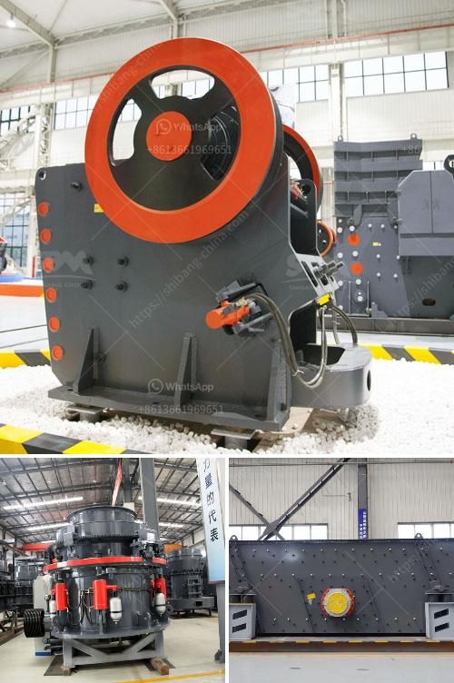

<h3>vertical roller mill price</h3>
The vertical roller mill is a type of grinding equipment that enables mining and other industrial sectors to grind raw materials into various fine powders. It is an energy-efficient alternative to traditional ball mills. The vertical roller mill has been widely used in the cement industry, which has made significant contributions to the rapid development of the cement industry due to its high efficiency, energy-saving, and environmental protection advantages.

When choosing a vertical roller mill, its price is an important factor for customers to consider. In general, the price of vertical roller mill is affected by various factors, including the model, capacity, and the manufacturer's reputation. The larger the capacity, the higher the price. Different manufacturers have different pricing strategies, and there may be price differences due to factors such as the brand and quality of the equipment.

In addition, the price of vertical roller mill is also related to the market supply and demand situation. If the market demand is high and the supply is limited, the price will be relatively high. On the contrary, if the market demand is low and the supply exceeds demand, the price will be relatively low.

However, it is worth noting that the price of vertical roller mill is not the only factor to consider when purchasing. The quality, performance, and after-sales service of the equipment are also important considerations. It is recommended to choose a reliable manufacturer that provides comprehensive services including equipment installation, commissioning, and maintenance to ensure the smooth operation of the vertical roller mill.

To sum up, the price of a vertical roller mill is influenced by multiple factors, including the model, capacity, market supply and demand, brand, and quality. Customers should not only focus on the price but also consider the overall performance and after-sales service of the equipment to make a wise purchasing decision.
<h3>Contact us</h3><ul><li><strong>Whatsapp:&nbsp;<a href="https://wa.me/8613661969651">+8613661969651</a></strong></li><li><a href="https://swt.shibang-china.com/?git&amp;zhl&amp;vertical roller mill price"><strong>Online Service(chat now)</strong></a></li></ul><h3>Related</h3><ul><li><a href='quarry crusher plant in malaysia.md'>quarry crusher plant in malaysia</a></li><li><a href='nigeria cone crusher.md'>nigeria cone crusher</a></li><li><a href='feasibility study for the establishment of quarry.md'>feasibility study for the establishment of quarry</a></li><li><a href='talc powder mill suppliers in china.md'>talc powder mill suppliers in china</a></li><li><a href='stone crusher machine sale tanzania.md'>stone crusher machine sale tanzania</a></li></ul>