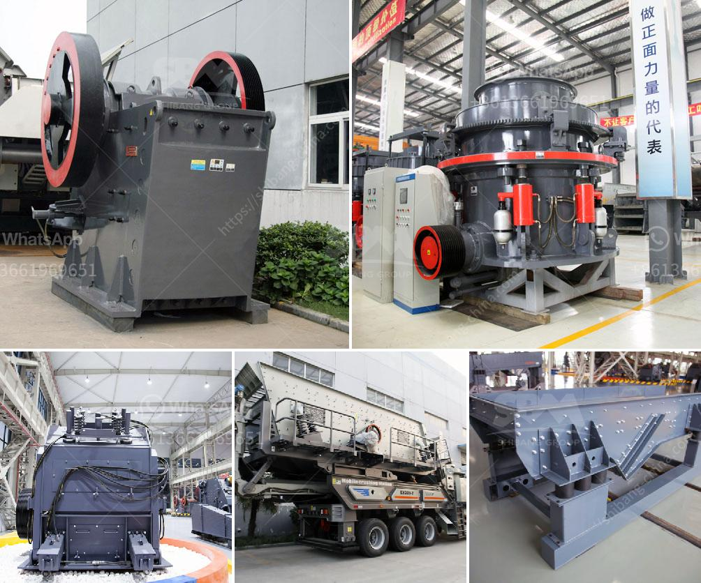

<h3>vibrating screen for mesh 14 vibrating screen</h3>
A vibrating screen for mesh 14 is a machine tool primarily used to separate various-sized materials or remove impurities from raw materials. Known for its high precision and efficiency, it can be used in many industries such as mining, construction, chemical, food, and pharmaceuticals.

The vibrating screen operates by using a motor to generate vibration, which causes the material to be sieved or separated according to its size. The screen mesh, or sieve, is made of metal wires that are woven tightly together to create a grid-like structure. The size of the mesh determines the size of the particles that can pass through it.

In the case of a vibrating screen for mesh 14, it means that the screen has 14 wires per inch. This mesh size is commonly used to separate materials with medium particle sizes. Anything below the mesh size will pass through the screen, while anything above it will be retained.

One of the key advantages of a vibrating screen is its high efficiency. The vibrating motion allows for a continuous and rapid sieving action, increasing the throughput and capacity of the machine. This makes it ideal for industries that require high production rates.

Additionally, a vibrating screen for mesh 14 offers excellent precision and accuracy in separating materials. The tight weave of the mesh ensures that even small particles are retained, preventing them from passing through the screen. This level of precision is essential for industries such as pharmaceuticals and food processing, where impurities or contaminants must be removed.

Furthermore, vibrating screens are incredibly versatile and can be customized to meet specific requirements. The screen can be adjusted to different angles, allowing for optimal screening efficiency and effective separation. Additionally, the amplitude and frequency of the vibration can be controlled to fine-tune the screening process.

When considering a vibrating screen for mesh 14, it is important to ensure that the machine is of high quality and durability. The materials used in its construction should be sturdy and resistant to wear and tear. The motor should be powerful enough to generate the required vibration, while also being energy-efficient.

Regular maintenance and cleaning of the vibrating screen are also crucial to maintain its performance and prolong its lifespan. This includes removing any buildup of material or debris on the screen, as well as lubricating the motor and other mechanical components.

In conclusion, a vibrating screen for mesh 14 is a versatile and efficient machine tool used in various industries to separate materials or remove impurities. Its high precision and capacity make it a valuable asset for businesses that require efficient screening and separation processes. By investing in a quality vibrating screen and conducting regular maintenance, businesses can ensure optimal performance and maximize their productivity.
<h3>Contact us</h3><ul><li><strong>Whatsapp:&nbsp;<a href="https://wa.me/8613661969651">+8613661969651</a></strong></li><li><a href="https://swt.shibang-china.com/?git&amp;zhl&amp;vibrating screen for mesh 14 vibrating screen"><strong>Online Service(chat now)</strong></a></li></ul><h3>Related</h3><ul><li><a href='stone crushing equipment available in northern cape.md'>stone crushing equipment available in northern cape</a></li><li><a href='granite tiles processing machines.md'>granite tiles processing machines</a></li><li><a href='impact crusher saudi arabia.md'>impact crusher saudi arabia</a></li><li><a href='ballast making machine kenya in kenya.md'>ballast making machine kenya in kenya</a></li><li><a href='vibrating screens manufacturers in south africa.md'>vibrating screens manufacturers in south africa</a></li></ul>