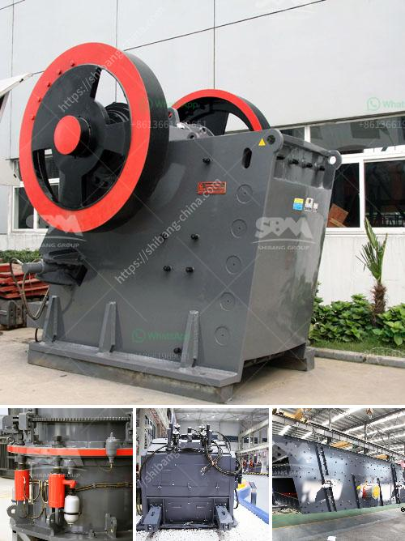

<h3>vibrating screen in egypt</h3>
Egypt, renowned for its rich historical heritage and resplendent landmarks, is now experiencing exponential growth in industries such as mining, construction, and infrastructure. Within these industries, the use of vibrating screens is gaining significant popularity. Vibrating screens are indispensable equipment in material handling applications and are widely used across multiple sectors due to their efficiency and versatility. This article will delve into the thriving vibrating screen market in Egypt, discussing its applications, benefits, and future prospects.

Vibrating screens find extensive usage in various sectors in Egypt, including mining, quarrying, aggregate production, cement, and recycling. In mining, these screens are used for efficiently separating and sorting ores, crushed stones, and minerals of different sizes. They help in optimizing the mining process by ensuring the quality of the extracted materials. In the construction industry, vibrating screens are employed for grading and sorting aggregates, sand, and concrete. Moreover, these screens are utilized in the manufacturing sector, aiding in the separation and classification of products, enhancing efficiency and productivity.

1. Enhanced Efficiency: Vibrating screens optimize the screening process by segregating bulky materials into different sizes, ensuring accurate particle distribution while removing impurities and debris. This results in improved overall efficiency, reduced material waste, and enhanced productivity.

2. Versatility: Vibrating screens offer versatility in terms of applications and adaptability to various materials. With customizable screen panels and an adjustable inclination angle, they can handle a wide range of materials and work seamlessly with different equipment, such as crushers, conveyors, and feeders.

3. Cost-Effective Solution: Investing in vibrating screens proves to be a cost-effective solution in the long run. By accurately sorting and segregating materials, these screens help reduce downstream equipment wear and tear, maintenance costs, and minimize downtime.

4. Safety and Environmentally Friendly: Vibrating screens contribute to a safer working environment as they help in eliminating manual sorting, reducing worker exposure to hazardous materials. Additionally, they promote environmental sustainability by minimizing the amount of waste generated and ensuring proper disposal/recycling of materials.

The future of vibrating screens in Egypt appears highly promising. As the country continues to witness rapid urbanization and infrastructure development, the demand for aggregates, sand, cement, and other construction materials is expected to surge. Therefore, the use of vibrating screens will remain crucial to efficiently process and separate these materials.

Moreover, with Egypt's growing focus on environmental sustainability, vibrating screens will play a pivotal role in ensuring the eco-friendly disposal and recycling of waste materials. This, coupled with the government's initiatives to attract foreign investments in various sectors, will further propel the demand for vibrating screens.

Egypt's construction, mining, and manufacturing sectors are witnessing substantial growth, and vibrating screens are becoming an integral part of their operations. With their efficiency, versatility, and cost-effective nature, vibrating screens are invaluable in optimizing material handling processes in Egypt. As the nation continues its development trajectory, the demand for vibrating screens is poised to rise, contributing to enhanced productivity, reduced waste, and a sustainable future.
<h3>Contact us</h3><ul><li><strong>Whatsapp:&nbsp;<a href="https://wa.me/8613661969651">+8613661969651</a></strong></li><li><a href="https://swt.shibang-china.com/?git&amp;zhl&amp;vibrating screen in egypt"><strong>Online Service(chat now)</strong></a></li></ul><h3>Related</h3><ul><li><a href='quarry machine price.md'>quarry machine price</a></li><li><a href='stone crusher machinery turkey.md'>stone crusher machinery turkey</a></li><li><a href='ball milling grinding machine in namibia.md'>ball milling grinding machine in namibia</a></li><li><a href='quartz powder manufacturers in india.md'>quartz powder manufacturers in india</a></li><li><a href='rental crusher vertical.md'>rental crusher vertical</a></li></ul>