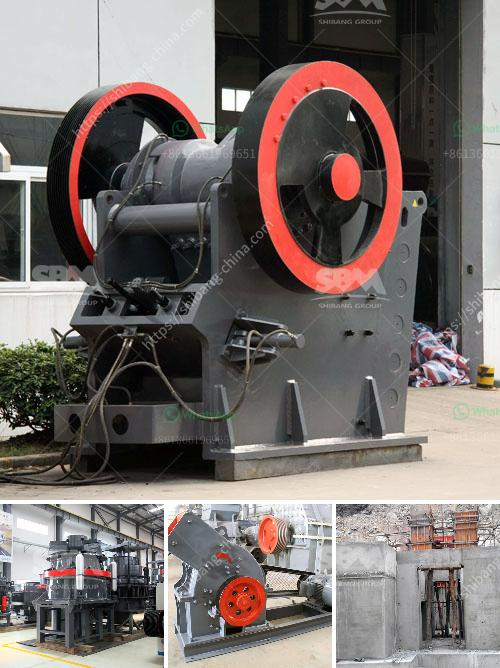

<h3>vibrating screen prices</h3>
When it comes to buying a vibrating screen, prices can vary significantly depending on several factors. These factors can include the size of the machine, its design features, and the quality of materials used in its construction. It is important to understand these factors in order to make an informed decision and get the best value for your money.

One of the primary factors that affect the price of a vibrating screen is its size. Larger screens, generally used in industries such as mining and construction, tend to be more expensive compared to smaller screens used in laboratories or small-scale production facilities. The price also varies based on the screen's capacity and throughput requirements, as higher-capacity screens will be more expensive.

The design features of a vibrating screen can also impact its price. Some screens are equipped with advanced technologies such as adjustable inclination, frequency control, or anti-blocking systems, which enhance their performance and durability. These features can increase the overall cost of the screen but may also provide added benefits in terms of efficiency and longevity.

The quality of materials used in the construction of the vibrating screen is another important consideration. Screens made with high-quality and durable materials, such as stainless steel or carbon steel, tend to be more expensive but offer better resistance against wear and tear, corrosion, and damage caused by heavy-duty operations. Investing in a screen with superior material quality can result in long-term cost savings due to reduced maintenance and replacement needs.

It is important to note that while price is an important factor, it should not be the sole determining factor when purchasing a vibrating screen. Other factors such as the reputation and reliability of the manufacturer, after-sales service, and customer support should also be considered. Additionally, it is recommended to compare prices from different suppliers to ensure that you are receiving a competitive offer for the product you require.

In conclusion, when considering vibrating screen prices, it is crucial to examine factors such as size, design features, and material quality to get a clear understanding of the value offered by the machine. By carefully evaluating these aspects, you can make an informed decision and select a vibrating screen that meets your specific requirements at the best possible price.
<h3>Contact us</h3><ul><li><strong>Whatsapp:&nbsp;<a href="https://wa.me/8613661969651">+8613661969651</a></strong></li><li><a href="https://swt.shibang-china.com/?git&amp;zhl&amp;vibrating screen prices"><strong>Online Service(chat now)</strong></a></li></ul><h3>Related</h3><ul><li><a href='ultrafine grinder mill construction.md'>ultrafine grinder mill construction</a></li><li><a href='screening and wash plant manufacturers in south africa.md'>screening and wash plant manufacturers in south africa</a></li><li><a href='how to build a garnet wash plant.md'>how to build a garnet wash plant</a></li><li><a href='for sale used mobile jaw crusher australia.md'>for sale used mobile jaw crusher australia</a></li><li><a href='chain conveyors crushers.md'>chain conveyors crushers</a></li></ul>