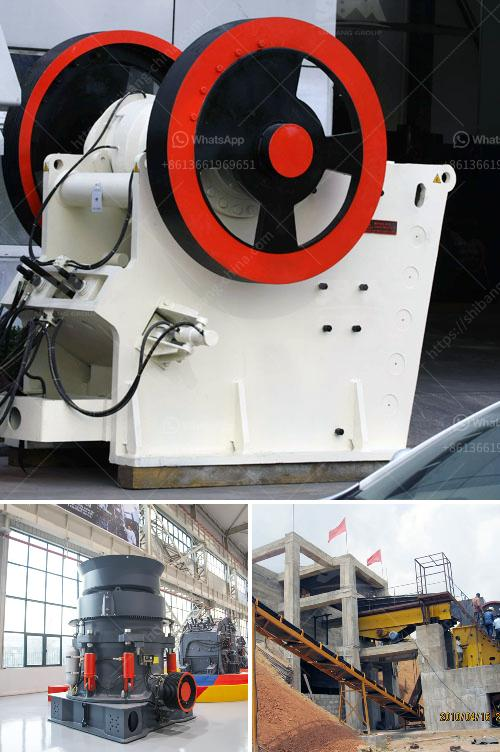

<h3>vibrating screens manufacturers in south africa</h3>
Vibrating screens manufacturers in South Africa offer various kinds of vibratory screens that are in high demand in the industrial sector. South Africa is experiencing high growth rates in terms of GDP, which is expected to boost the manufacturing sector and increase demand for vibrating screens required for various industrial applications.

Vibrating screens are used in several industries, including mining, agriculture, food processing, recycling, and chemical industries. They efficiently separate particles based on their sizes or shapes, helping in enhancing productivity and processing efficiency.

One of the leading manufacturers of vibrating screens in South Africa is Vibramech. Established in 1978, this South African-based company specializes in the design and manufacture of robust vibrating equipment for the mining and mineral processing industries. They are known for their high-quality products and commitment to customer satisfaction.

Vibramech offers a range of vibrating screens, including horizontal screens, inclined screens, multislope screens, and dewatering screens. Each screen is designed to suit the specific requirements of the application, ensuring optimal performance and efficient separation of materials.

Another prominent manufacturer of vibrating screens in South Africa is Osborn. With over 100 years of experience in this field, Osborn has a reputation for manufacturing durable and reliable vibrating screens. They offer a wide range of screens, including horizontal and inclined screens, as well as vibrating grizzly feeders.

Osborn screens are known for their robust construction, designed to withstand the harsh operating conditions encountered in the mining industry. They feature high-quality bearings, heavy-duty decks, and efficient mechanical drives to ensure maximum performance and longevity.

In addition to Vibramech and Osborn, there are several other vibrating screen manufacturers in South Africa. These include KWATANI, JOEST, and Screenex. Each manufacturer offers a unique range of products to meet the diverse needs of their customers.

KWATANI, for example, specializes in customized vibrating screens designed to suit specific applications. They offer advanced technology and innovative design solutions to deliver efficient screening and separation across various industries.

JOEST, on the other hand, has a diverse range of vibrating screens and feeders, designed for the mining, quarrying, and mineral processing industries. They pride themselves on providing customized solutions to meet individual customer requirements.

Screenex is a manufacturer of woven wire screens, polyurethane screens, and modular polyurethane screening panels. They have a strong focus on product quality and durability, offering reliable screening solutions for various applications.

Overall, the vibrating screen manufacturing industry in South Africa is vibrant, with several reputable manufacturers providing high-quality products to meet the growing demand. Their commitment to innovation, reliability, and customer satisfaction positions South African manufacturers as leaders in the global vibrating screen market.
<h3>Contact us</h3><ul><li><strong>Whatsapp:&nbsp;<a href="https://wa.me/8613661969651">+8613661969651</a></strong></li><li><a href="https://swt.shibang-china.com/?git&amp;zhl&amp;vibrating screens manufacturers in south africa"><strong>Online Service(chat now)</strong></a></li></ul><h3>Related</h3><ul><li><a href='bentonite crushers manufacturers.md'>bentonite crushers manufacturers</a></li><li><a href='cement plant process flow diagram ppt.md'>cement plant process flow diagram ppt</a></li><li><a href='ball mill education.md'>ball mill education</a></li><li><a href='gypsum board manufacturing plant cost india.md'>gypsum board manufacturing plant cost india</a></li><li><a href='eco stone crusher.md'>eco stone crusher</a></li></ul>