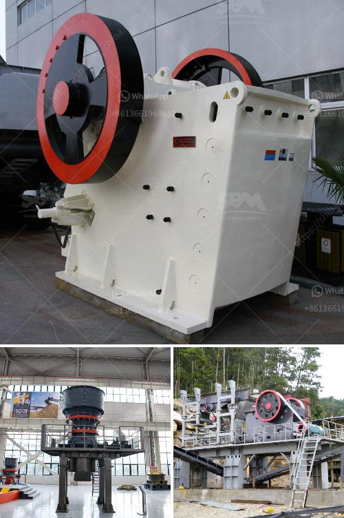

<h3>vibrating screens manufacturers india</h3>
The vibrating screens manufacturers in India today specialize in designing and manufacturing a wide range of high-quality vibrating screens. They provide impeccable products for various industries such as mining, construction, pharmaceutical, chemical, and fertilizer industries. With the continuous development of the country's infrastructure, there is a growing demand for robust and reliable vibrating screens that can withstand the toughest conditions.

Vibrating screens play a crucial role in separating materials and ensuring better efficiency and accuracy in the production process. Manufacturers in India are catering to the market's need for advanced equipment that can easily suffice the stringent production requirements.

To meet this need, manufacturers are creating devices that are effective and user-friendly. Some of the significant advancements include the use of durable materials, improved manufacturing techniques, and automated systems. These improvements have resulted in the development of vibrating screens that are efficient, reliable, and highly productive.

Reliability is crucial, especially in industries where a significant investment is made in machinery and equipment. Vibrating screens manufacturers in India are trying to provide the best quality machines to their customers, ensuring optimum productivity and long-term durability. With the ever-increasing demand for quicker, more efficient products, the manufacturers are adding advanced features to their vibrating screens.

One such feature is a self-cleaning mechanism, which reduces downtime and increases productivity. The self-cleaning mechanism allows the screen to remain clear and free from any clogs or blockages, ensuring continuous operation. This feature is particularly useful in industries that deal with sticky materials, such as adhesive or wet powders.

Additionally, vibrating screens manufacturers in India offer various types of screening mediums. With multiple options available in the market, it becomes easier for companies to select the screen most suitable for their production needs. Wire mesh, perforated sheets, and rubber or polyurethane mats are commonly used screening mediums. Each type has its own set of advantages, such as high durability, minimal maintenance, or ability to handle high moisture content.

Innovation is a key aspect of the vibrating screens industry in India, where manufacturers are constantly trying to enhance their products through research and development. The integration of advanced technologies like IoT, AI, and remote monitoring systems has allowed them to provide smarter solutions to their customers. These technologies enable real-time fault detection and predictive maintenance, ensuring minimal downtime and maximizing productivity.

The Indian manufacturers are also focusing on reducing the environmental impact of their vibrating screens through eco-friendly design and energy-efficient operations. By leveraging renewable energy sources and using recyclable materials, they are taking steps towards sustainability.

In conclusion, vibrating screens manufacturers in India are providing reliable and efficient solutions that cater to the diverse needs of various industries. Through continuous research and development, they have been able to enhance their products and incorporate advanced technologies. These advancements have resulted in the production of high-quality vibrating screens that are durable, efficient, and environmentally friendly.
<h3>Contact us</h3><ul><li><strong>Whatsapp:&nbsp;<a href="https://wa.me/8613661969651">+8613661969651</a></strong></li><li><a href="https://swt.shibang-china.com/?git&amp;zhl&amp;vibrating screens manufacturers india"><strong>Online Service(chat now)</strong></a></li></ul><h3>Related</h3><ul><li><a href='high energy ball mill price.md'>high energy ball mill price</a></li><li><a href='komatsu mobile crushers price.md'>komatsu mobile crushers price</a></li><li><a href='rock crushing machine for concrete use.md'>rock crushing machine for concrete use</a></li><li><a href='feasibility study for the establishment of quarry.md'>feasibility study for the establishment of quarry</a></li><li><a href='processing of cement crusher.md'>processing of cement crusher</a></li></ul>