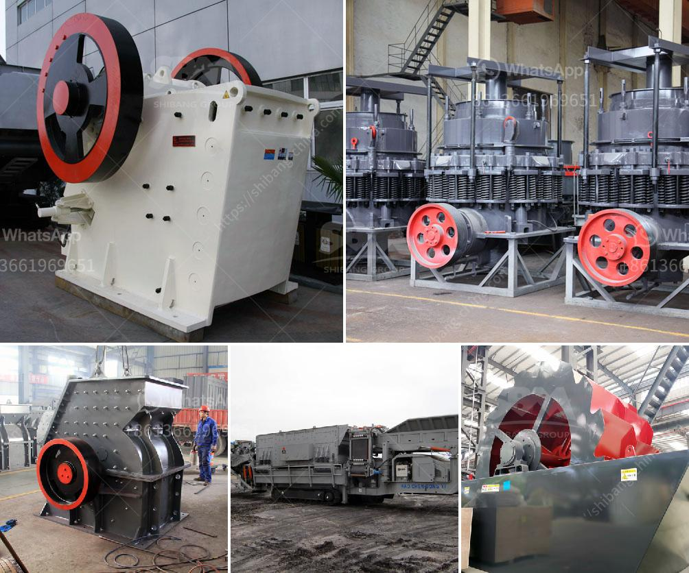

<h3>vibratory screen manufacturer in europe</h3>
Vibratory screens have become an essential part of numerous industries across the world. From mining and construction to food processing and pharmaceuticals, these screens offer efficient and cost-effective solutions for separating and classifying materials. When it comes to vibratory screen manufacturers, Europe is known for its commitment to producing high-quality machines that deliver excellent performance, durability, and reliability.

Europe is home to several renowned vibratory screen manufacturers who have been catering to the needs of various industries for decades. These manufacturers specialize in designing and manufacturing a wide range of vibratory screens to meet the unique requirements of different applications.

One of the key advantages of choosing a vibratory screen manufacturer in Europe is the emphasis on quality assurance. European manufacturers adhere to stringent quality control standards and have well-defined processes to ensure that the machines they produce are of the highest quality. They use advanced technologies and modern manufacturing facilities to create screens that are both robust and efficient. This commitment to quality not only enhances the overall performance of the screens but also minimizes downtime and maintenance costs for the end-users.

The vibratory screens manufactured in Europe are known for their versatility. These screens can handle a wide range of materials, including minerals, aggregates, plastics, chemicals, and more. Whether it is a wet or dry application, heavy or light-duty screening, Europe-based manufacturers have the expertise to design screens that deliver exceptional results. Moreover, they offer customization options to tailor the screens to specific needs, ensuring optimal efficiency and productivity.

European vibratory screen manufacturers also place great emphasis on innovation and research. They continuously invest in research and development to bring forth new technologies and improvements to their screens. This commitment to innovation allows European manufacturers to stay ahead of the curve and provide cutting-edge solutions to their customers.

In addition to superior quality and innovation, vibratory screen manufacturers in Europe are also known for their excellent customer service. They work closely with their clients to understand their unique needs and provide the right solutions. From pre-sales consultation to after-sales service and support, European manufacturers offer comprehensive assistance and ensure that their customers are completely satisfied.

With the growing demand for vibratory screens in various industries, choosing the right manufacturer becomes crucial. European manufacturers bring years of experience, expertise, and a commitment to quality that sets them apart. Whether it is a small-scale operation or a large industrial application, vibratory screen manufacturers in Europe are well-equipped to deliver screens that meet the highest standards of performance, efficiency, and durability.

In conclusion, Europe serves as a hub for vibratory screen manufacturers that prioritize quality, innovation, and customer satisfaction. Their expertise in designing and manufacturing top-notch vibratory screens makes them the preferred choice for industries across the globe. With their commitment to excellence, European manufacturers ensure that their customers achieve superior results and maximize their operational efficiency.
<h3>Contact us</h3><ul><li><strong>Whatsapp:&nbsp;<a href="https://wa.me/8613661969651">+8613661969651</a></strong></li><li><a href="https://swt.shibang-china.com/?git&amp;zhl&amp;vibratory screen manufacturer in europe"><strong>Online Service(chat now)</strong></a></li></ul><h3>Related</h3><ul><li><a href='limestone impact crusher wobbler.md'>limestone impact crusher wobbler</a></li><li><a href='quartz crusher for sale.md'>quartz crusher for sale</a></li><li><a href='costs of a grinding mill.md'>costs of a grinding mill</a></li><li><a href='tanzania small stone crusher sale.md'>tanzania small stone crusher sale</a></li><li><a href='stone crusher gangs in jamaica.md'>stone crusher gangs in jamaica</a></li></ul>