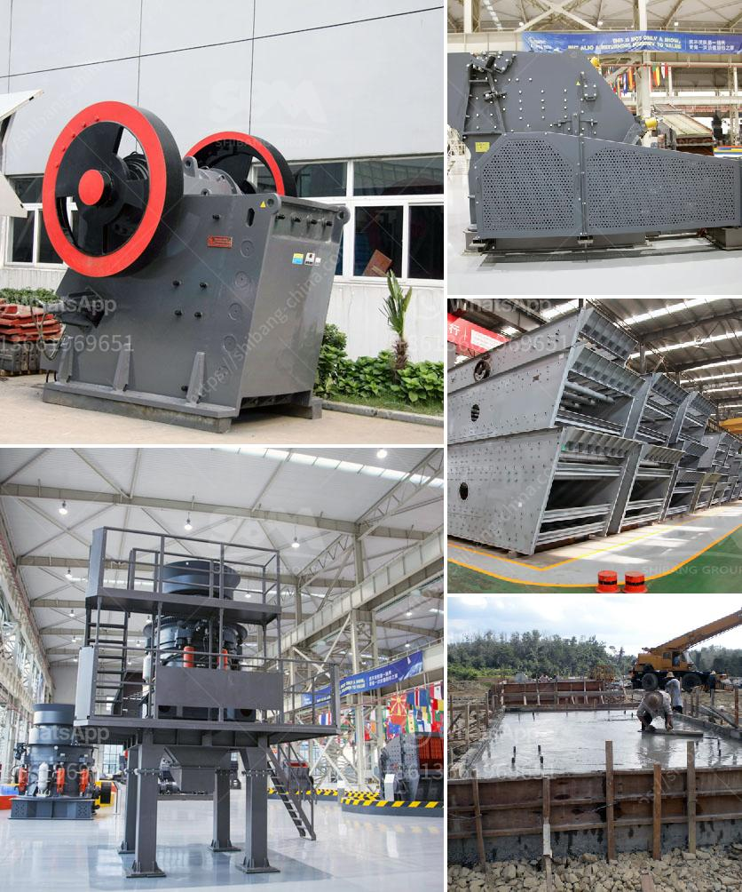

<h3>vibro feeder price listing south africa</h3>
Vibro feeder is a type of vibrating feeder used in various industries for transferring and controlling the flow of materials. It is widely used in mining, building materials, chemical, metallurgy, and other industries. In South Africa, the vibro feeder price listing is an important consideration for many buyers who require this equipment for their operations.

The price of a vibro feeder in South Africa can vary depending on several factors. These factors include the capacity of the feeder, the size of the feeder, the type of materials it is designed to handle, and the overall quality of the equipment. Generally, the price range for a vibro feeder in South Africa can range from around $500 to $5,000 or more.

One of the primary factors that affect the price of a vibro feeder is the capacity of the equipment. Higher capacity feeders are typically more expensive due to the larger and more robust construction required to handle larger quantities of materials. Most vibro feeders in South Africa have a capacity ranging from a few hundred kilograms to several tons per hour.

Another factor that influences the price of vibro feeders is the size of the equipment. Larger feeders require more materials and labor during the manufacturing process, which can result in a higher price. Smaller feeders, on the other hand, may be more affordable. The size of the feeder required will depend on the specific application and the volume of material that needs to be transferred.

The type of materials that the vibro feeder is designed to handle is also an important consideration. Some feeders are specifically designed for handling abrasive or corrosive materials, while others are designed for handling fragile or sensitive materials. The construction and material of the feeder will vary depending on the type of material it is designed to handle. Feeders designed for handling abrasive materials, for example, may be constructed with wear-resistant materials such as hardened steel or rubber linings.

Lastly, the overall quality and reputation of the manufacturer can affect the price of a vibro feeder. Established and reputable manufacturers often charge higher prices for their equipment due to their experience, quality control processes, and after-sales support. However, investing in a high-quality vibro feeder can result in longer service life, fewer maintenance requirements, and overall better performance.

In conclusion, the price of a vibro feeder in South Africa can vary depending on factors such as capacity, size, materials handling capabilities, and the reputation of the manufacturer. Buyers should carefully consider their specific requirements and budget when deciding on a suitable vibro feeder for their operations. It is recommended to contact multiple manufacturers or suppliers to request price quotations and compare them to make an informed decision.
<h3>Contact us</h3><ul><li><strong>Whatsapp:&nbsp;<a href="https://wa.me/8613661969651">+8613661969651</a></strong></li><li><a href="https://swt.shibang-china.com/?git&amp;zhl&amp;vibro feeder price listing south africa"><strong>Online Service(chat now)</strong></a></li></ul><h3>Related</h3><ul><li><a href='granite edge cutting machine in sweden.md'>granite edge cutting machine in sweden</a></li><li><a href='carbomer ball mill.md'>carbomer ball mill</a></li><li><a href='rock crusher mine price peru.md'>rock crusher mine price peru</a></li><li><a href='price of stone crusher in philippines.md'>price of stone crusher in philippines</a></li><li><a href='artificial sand project.md'>artificial sand project</a></li></ul>