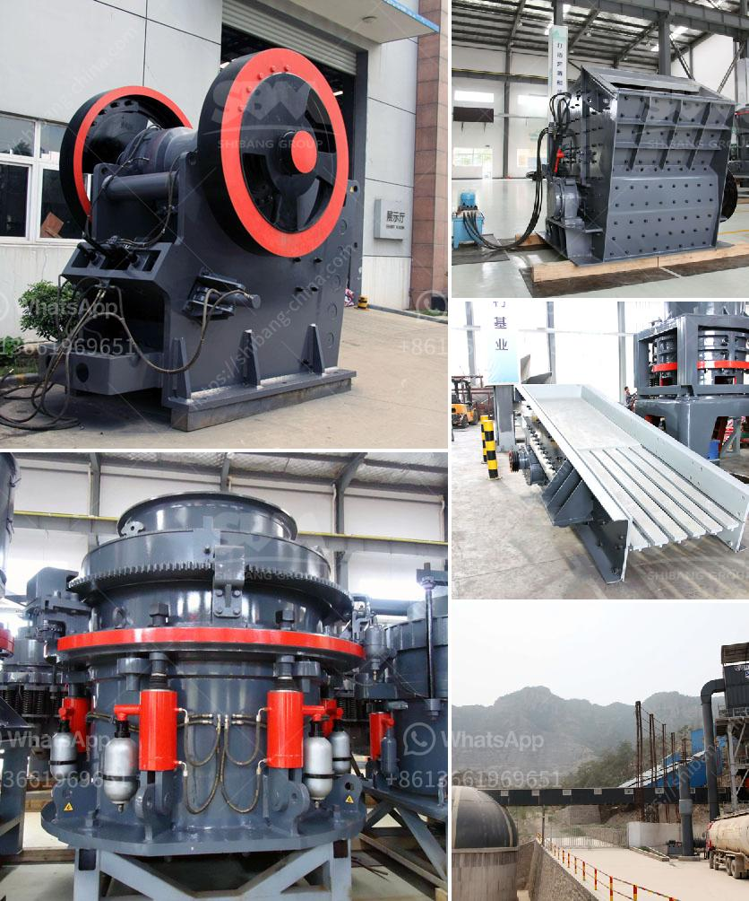

<h3>washing plant suppliers in mozambique</h3>
Mozambique, a vibrant country in southeastern Africa, has been experiencing tremendous economic growth over the past few decades. Rich in natural resources, particularly in mining and agriculture, the country has attracted significant foreign investment. One crucial industry that has emerged as a key driver in Mozambique's growth is the washing plant sector.

Washing plants, also known as processing plants or beneficiation plants, play a critical role in various industries by extracting valuable minerals from raw materials and preparing them for sale or further processing. They are commonly used in mining, agriculture, construction, and recycling sectors, making them a pivotal component of Mozambique's industrial development.

As the demand for minerals and processed materials continues to rise globally, the need for reliable washing plant suppliers becomes paramount. Mozambique is fortunate to have several reputable and experienced suppliers operating within its borders. These suppliers not only cater to the domestic market but also meet international demands, contributing significantly to the country's economy.

One prominent washing plant supplier in Mozambique is XYZ Mining Equipment Company. With decades of industry experience and expertise, XYZ has established itself as a leading provider of mining and processing equipment. Their washing plants are known for optimizing the extraction and separation processes, ensuring maximum yield and quality of the end products.

In addition to traditional mining, the agricultural sector in Mozambique also greatly benefits from washing plant suppliers. As an agriculture-based economy, Mozambique relies heavily on the cultivation and export of cash crops such as cotton, tobacco, sugar, and fruits. Washing plants help enhance the quality and value of these crops by efficiently removing impurities, increasing exports, and driving revenue growth.

Another noteworthy supplier, ABC Processing Solutions, specializes in providing washing plants tailored to the specific requirements of the agriculture sector. By working closely with local farmers, ABC ensures that their processing equipment can effectively handle the unique characteristics of Mozambique's agricultural products, contributing to improved productivity and competitiveness.

In recent years, there has been a growing emphasis on sustainability and environmentally friendly practices in the washing plant industry. Mozambique's washing plant suppliers have embraced this trend by incorporating innovative technologies and practices that reduce water and energy consumption, minimize waste generation, and mitigate environmental impacts.

For instance, DEF EcoSolutions, a reputable washing plant supplier, has developed a range of eco-friendly technologies that drive environmental sustainability without compromising on performance and efficiency. Their plants utilize advanced water recycling systems, efficient filtration methods, and optimized energy management systems, significantly reducing the environmental footprint associated with washing processes.

As Mozambique continues to attract investment and expand its industrial capacity, the washing plant sector will play a pivotal role in facilitating economic growth and sustainability. By partnering with reliable and reputable suppliers that prioritize innovation and environmental responsibility, Mozambique can optimize its raw materials and ensure the highest quality end products.

Furthermore, the growth of the washing plant sector also presents an opportunity for local job creation and skills development. As suppliers expand their operations, they require qualified engineers, technicians, and maintenance personnel, providing employment opportunities and fostering a skilled workforce in Mozambique.

In conclusion, the washing plant industry in Mozambique is a vital component of the country's economic growth, catering to both domestic and international demands. The presence of reputable suppliers who prioritize efficiency, quality, and sustainability allows for the optimization of resources and the generation of revenue. As Mozambique continues to invest in industrial development, it is crucial to support and promote the role of washing plant suppliers in driving economic growth and sustainability.
<h3>Contact us</h3><ul><li><strong>Whatsapp:&nbsp;<a href="https://wa.me/8613661969651">+8613661969651</a></strong></li><li><a href="https://swt.shibang-china.com/?git&amp;zhl&amp;washing plant suppliers in mozambique"><strong>Online Service(chat now)</strong></a></li></ul><h3>Related</h3><ul><li><a href='cost of crushing and screening.md'>cost of crushing and screening</a></li><li><a href='process of making talcum powder.md'>process of making talcum powder</a></li><li><a href='barite powder production process.md'>barite powder production process</a></li><li><a href='calcium carbonate ball mill.md'>calcium carbonate ball mill</a></li><li><a href='cost of an copper ore crusher.md'>cost of an copper ore crusher</a></li></ul>