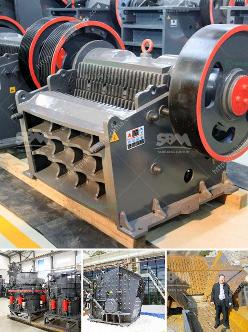

<h3>washing process of chromite ore beneficiation</h3>
Chromite is a mineral composed primarily of iron, magnesium, and chromium oxide. It is one of the essential ores used for the production of stainless steel and various other metal alloys. To obtain usable chromite ore, it undergoes a series of beneficiation processes, including crushing, grinding, screening, and washing.

The washing process of chromite ore beneficiation involves the introduction of water to the ore through a variety of means to separate the valuable material from the waste. The first step involves the introduction of water through vibrating screens into a coarse ore bin. The ore is then conveyed to a scrubbing circuit, where attritioning impurities such as clay and sand are removed. The attritioning process involves the use of water, chemicals, and friction to break down and remove these impurities, effectively cleaning the ore.

Following the scrubbing process, the ore is then fed into a spiral classifier, where the slurry is further separated according to particle size. This classification process helps to ensure that the ore particles are evenly distributed for subsequent treatment. The spiral classifier operates on the principle of gravity separation, where the heavier and larger particles settle to the bottom, while the finer particles are carried upwards in the water flow.

After classification, the ore is fed into a hydrocyclone, which utilizes centrifugal force to separate the particles based on density. The hydrocyclone operates by creating a swirling motion within the cone-shaped chamber, causing denser particles to migrate towards the outer wall and be collected as a concentrated product. Lighter particles, on the other hand, are swept upwards and discharged as overflow.

The next step in the washing process involves dewatering the chromite ore. This is typically done using a high-frequency dewatering screen, which removes excess water from the ore by vibrating it at a high frequency. This helps to reduce the moisture content of the ore, making it more suitable for further processing and transportation.

Overall, the washing process of chromite ore beneficiation plays a crucial role in improving the quality and purity of the chromite concentrate. By removing impurities and excess water, the process ensures that the final product meets the desired specifications for its end-use applications. The use of water in the washing process also helps to reduce the environmental impact of chromite ore beneficiation by minimizing the release of pollutants into water bodies.

In conclusion, the washing process of chromite ore beneficiation is a vital step in obtaining usable chromite ore. Through a combination of mechanical and chemical processes, impurities are removed, and the ore is classified and dewatered to enhance its quality. This not only improves the efficiency of subsequent processing but also reduces the environmental impact of chromite ore beneficiation.
<h3>Contact us</h3><ul><li><strong>Whatsapp:&nbsp;<a href="https://wa.me/8613661969651">+8613661969651</a></strong></li><li><a href="https://swt.shibang-china.com/?git&amp;zhl&amp;washing process of chromite ore beneficiation"><strong>Online Service(chat now)</strong></a></li></ul><h3>Related</h3><ul><li><a href='crushing plant aggregates in south africa.md'>crushing plant aggregates in south africa</a></li><li><a href='price high energy ball milling.md'>price high energy ball milling</a></li><li><a href='stone crusher machinery turkey.md'>stone crusher machinery turkey</a></li><li><a href='price crusher machinery price.md'>price crusher machinery price</a></li><li><a href='vertical mill of a cement company.md'>vertical mill of a cement company</a></li></ul>