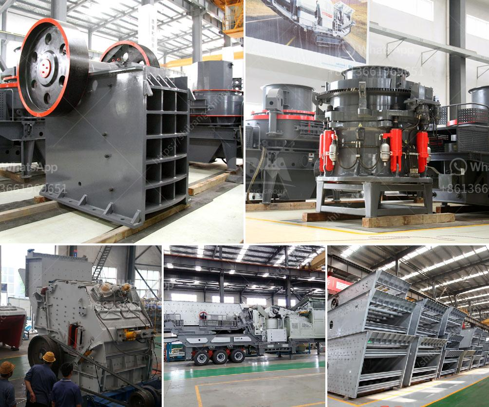

<h3>wet grinding ball mills china</h3>
Wet grinding ball mills have been an essential part of many industrial processes for years. This type of equipment is capable of grinding and crushing materials into extremely fine particles. These machines are commonly used in the mining industry, where they are employed to reduce the size of ore particles before further processing. China has been a leading producer and consumer of wet grinding ball mills due to its massive industrial growth and demand for raw materials.

One of the key advantages of wet grinding ball mills is that they can process a wide range of materials, including minerals, ores, and chemicals. The wet grinding process involves feeding the material into the mill and allowing it to be ground by the grinding media, typically steel balls, which rotate within the mill. As the material is ground, it is mixed with water to create a slurry, which helps to reduce friction and prevent the buildup of heat. This wet grinding process ultimately results in a finer, more homogeneous product.

China has become a dominant player in the production of wet grinding ball mills, with many manufacturers offering a wide range of models tailored to suit different industrial applications. These mills are available in various sizes, ranging from small laboratory mills to large industrial mills capable of processing large quantities of material. Many Chinese manufacturers pride themselves on their ability to customize these mills to meet specific customer requirements.

In recent years, China has seen significant advancements in the design and technology of wet grinding ball mills. Manufacturers have focused on improving the efficiency and performance of these machines by incorporating features such as advanced control systems, energy-saving mechanisms, and enhanced wear resistance. These advancements have not only led to higher production rates and improved product quality but have also contributed to reducing the overall operating costs of these mills.

China's wet grinding ball mills are widely used in various industries, including mining, cement, ceramics, and chemicals. In the mining industry, these mills are used to grind ores and other minerals to produce valuable mineral concentrates or fine powders. Similarly, in the cement industry, wet grinding ball mills are used to grind raw materials, such as limestone and clay, to produce cement mixtures. In the ceramics industry, these mills are employed to grind ceramics materials into fine powders that can be used to manufacture ceramic products. Additionally, wet grinding ball mills are used in the chemical industry to grind chemicals and other substances into fine particles.

In conclusion, wet grinding ball mills have proven to be essential equipment in various industries, and China stands out as a leading producer of these machines. The country's continuous technological advancements and commitment to customization have made Chinese wet grinding ball mills popular both domestically and internationally. As demand for wet grinding ball mills continues to rise, China is expected to remain at the forefront of this industry by constantly innovating and providing efficient solutions to meet the evolving needs of its customers.
<h3>Contact us</h3><ul><li><strong>Whatsapp:&nbsp;<a href="https://wa.me/8613661969651">+8613661969651</a></strong></li><li><a href="https://swt.shibang-china.com/?git&amp;zhl&amp;wet grinding ball mills china"><strong>Online Service(chat now)</strong></a></li></ul><h3>Related</h3><ul><li><a href='construction waste recycling.md'>construction waste recycling</a></li><li><a href='estimated cost for cement grinding mill.md'>estimated cost for cement grinding mill</a></li><li><a href='gypsum board manufacturing plant cost india.md'>gypsum board manufacturing plant cost india</a></li><li><a href='stone crusher manufacture.md'>stone crusher manufacture</a></li><li><a href='gypsum processing machines.md'>gypsum processing machines</a></li></ul>