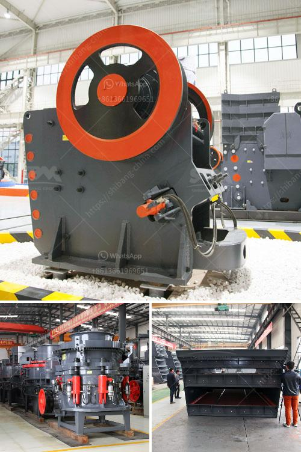

<h3>wet grinding mill china</h3>
China's wet grinding mill industry has undergone rapid development in recent years, making it a major contributor to the processing of various materials. This mill is especially suitable for grinding wet materials such as ores, chemicals, and ceramic raw materials. Innovations in technology and the introduction of advanced machinery have transformed the wet grinding mill industry in China, empowering manufacturers to produce high-quality products efficiently. In this article, we will delve into the wet grinding mill industry in China, exploring its importance, advancements, and applications.

Wet grinding mills play a crucial role in the industrial sector, facilitating the particle size reduction process. They operate by continuously feeding the material into the mill chamber where it is ground and dispersed in a liquid medium. This process allows for efficient particle size reduction while preventing agglomeration and ensuring a homogeneous and fine end product. The wet grinding mill China's industries rely on helps improve product quality, reduce energy consumption, and increase overall productivity.

The wet grinding mill industry in China has experienced significant advancements in technology, leading to the introduction of state-of-the-art machinery. These advancements have improved the overall efficiency, reliability, and performance of wet grinding mills, further driving their adoption across various industries. One such technological breakthrough is the integration of computer control systems, enabling automated operation and precise control of grinding parameters, resulting in consistent and high-quality output.

In recent years, wet grinding mills in China have been engineered to be more energy-efficient and environmentally sustainable. Innovations such as the use of advanced grinding media and the optimization of grinding chamber designs have significantly reduced energy consumption and material waste. Additionally, manufacturers are increasingly adopting greener manufacturing practices by implementing water recycling systems, minimizing water consumption, and reducing carbon emissions.

The versatility of wet grinding mills has expanded their applications across numerous industries in China. Key sectors that benefit from wet grinding mill technologies include:

1. Mining and Minerals: Wet grinding mills are widely used in mineral processing, particularly in the processing of gold, copper, and iron ore to attain the desired particle size for downstream separation processes.

2. Chemicals and Paints: Wet grinding mills are essential in the production of various chemicals and pigments, ensuring consistent particle size distribution and improved color strength.

3. Ceramics and Glass: Wet grinding mills facilitate the preparation of ceramic slurries and glass frits, allowing for improved product quality and reducing defects.

The wet grinding mill industry in China has come a long way, revolutionizing various industrial grinding processes. With continuous advancements in technology, manufacturers have been able to produce high-quality products efficiently, leading to improved productivity and reduced environmental impact. As the demand for finer and more uniform particle sizes continues to rise, wet grinding mills will remain a crucial component of numerous industries in China, driving technological innovations and sustainable manufacturing practices.
<h3>Contact us</h3><ul><li><strong>Whatsapp:&nbsp;<a href="https://wa.me/8613661969651">+8613661969651</a></strong></li><li><a href="https://swt.shibang-china.com/?git&amp;zhl&amp;wet grinding mill china"><strong>Online Service(chat now)</strong></a></li></ul><h3>Related</h3><ul><li><a href='limestone ore concentration plant.md'>limestone ore concentration plant</a></li><li><a href='equipments used in cement industry.md'>equipments used in cement industry</a></li><li><a href='ball mill grinder.md'>ball mill grinder</a></li><li><a href='mill grinding machine for sale.md'>mill grinding machine for sale</a></li><li><a href='hammer mill for cerelaes.md'>hammer mill for cerelaes</a></li></ul>