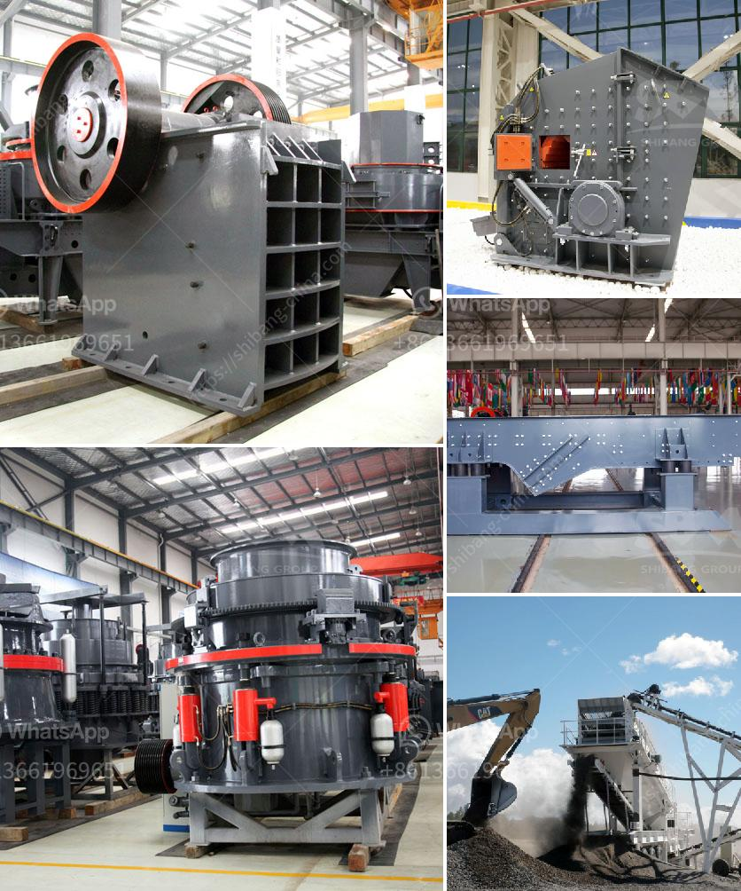

<h3>wet process cement</h3>
Cement is a vital component in infrastructure development worldwide. It is a binding material that, when mixed with water, forms a paste that hardens and binds various aggregates together. Cement production processes vary, depending on the type of cement being produced. One such process is the wet process.

The wet process of cement manufacturing involves the grinding of raw materials such as limestone and clay, which are mixed with water to form a slurry. This slurry is then dried, powdered, and heated to a temperature of about 1500 degrees Celsius in a kiln. The resulting clinker is then mixed with gypsum to produce the final cement product.

The wet process has been used for cement production for many years due to its numerous advantages. One advantage of the wet process is its ability to produce a more consistent and higher quality cement. The wet process allows for better control over the chemical composition of the raw materials, ensuring that the final product meets the desired specifications. This is especially important for specialized cements, such as those used in the construction of high-rise buildings or underwater structures.

Another advantage of the wet process is its energy efficiency. The high heat required for the drying and calcination of raw materials is provided by the fuel used in the kiln. The heat generated during the combustion of this fuel is effectively utilized in the wet process, resulting in less energy wastage. Additionally, the use of water in the slurry facilitates the heat transfer process, further enhancing energy efficiency.

The wet process also offers environmental benefits. By utilizing water in the manufacturing process, dust emissions are significantly reduced, improving air quality in and around the cement plants. Additionally, the use of water enables the capture and control of air pollutants through wet scrubbers, further minimizing the environmental impact.

Despite its advantages, the wet process does have some limitations. One major drawback is its high water consumption. The process requires a significant amount of water, resulting in increased water usage and potential strain on water resources, especially in regions facing water scarcity.

The wet process also requires a longer time for the clinker to cool after leaving the kiln. This longer cooling time can result in a slower production rate and increased energy consumption if not managed efficiently.

In recent years, the industry has sought more sustainable and environmentally friendly alternatives to the wet process. One such alternative is the dry process, which has gained popularity due to its lower energy consumption and water requirement. However, the wet process remains prevalent in certain regions where water is abundant and where the production of specialized cements is in high demand.

In conclusion, the wet process of cement manufacturing offers numerous advantages, including the production of consistent quality cement, energy efficiency, and environmental benefits. However, it also has limitations in terms of water consumption and longer cooling times. As the industry continues to evolve, a balance between wet and dry processes must be struck to ensure sustainable cement production and meet the growing global infrastructure needs.
<h3>Contact us</h3><ul><li><strong>Whatsapp:&nbsp;<a href="https://wa.me/8613661969651">+8613661969651</a></strong></li><li><a href="https://swt.shibang-china.com/?git&amp;zhl&amp;wet process cement"><strong>Online Service(chat now)</strong></a></li></ul><h3>Related</h3><ul><li><a href='jaw crusher 150 ton pricing.md'>jaw crusher 150 ton pricing</a></li><li><a href='closing of crushing plant.md'>closing of crushing plant</a></li><li><a href='hammer mills used in gold mining.md'>hammer mills used in gold mining</a></li><li><a href='cost of a conveyor belt in india.md'>cost of a conveyor belt in india</a></li><li><a href='starting up a small scale gold mine in zimbabwe.md'>starting up a small scale gold mine in zimbabwe</a></li></ul>