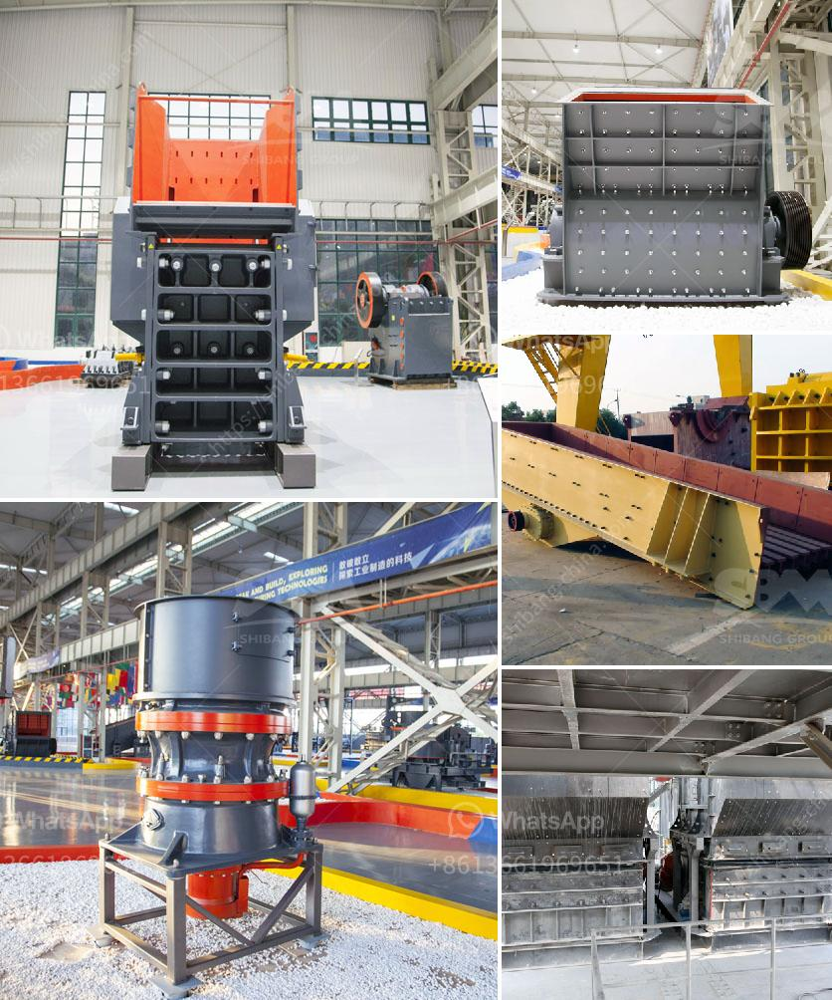

<h3>what is the best granite crusher machine</h3>
Granite is a common type of igneous rock that is granular in texture. Granite is widely used as a dimension stone, making it perfect for construction projects such as roads, bridges, and buildings. With its durable nature and diverse range of colors, granite has become a popular choice for countertops, flooring, and other decorative applications.

To meet the growing demand for granite, it is crucial to have efficient machinery that can process large quantities of granite into the desired size and shape. Among the various types of machinery available, granite crusher machines are widely used in the granite processing plant.

A granite crusher machine is necessary at the moment. Granite crusher machine can be widely used in mining, metallurgy, construction, chemicals and other industries. It can crush the materials with length below 100-500mm and compression strength is less than 350 MPA. In addition, granite crusher machine has the following advantages, such as simple structure, unique impact liner, large crushing rate, cubic production granularity, adjustable discharge size, etc.

All of these make the granite crusher machine highly recognized by users. However, when purchasing equipment, users cannot ignore the quality of the equipment. Only by choosing a granite crusher with reliable performance and excellent quality, can customers achieve better crushing effects. Granite crushing production line mainly consists of vibrating feeder, jaw crusher, cone crusher, impact crusher, vibrating screen, belt conveyor and electronic control system.

Once granite is crushed, it can be used for various purposes, such as making cement or acting as an aggregate in concrete production. In addition, granite crushing machines have a wide range of applications. Even though you are only searching for a granite crusher machine for your business, you still need to ensure that the machine is produced by a professional manufacturer.

This is because there are a lot of manufacturers in the market who manufacture substandard products. So, it is essential to do some market research before you make a purchase. A reliable granite crusher machine supplier must have its own corporate reputation.

In conclusion, the quality of granite crusher machines determines the price of the whole machine. Only by choosing a granite crusher machine with reliable performance and excellent quality, can customers achieve better crushing effects which means higher profits in the long run. The best choice is the deep cavity jaw crusher in the granite crusher machines. If you want to know more, details you can send a message to us, and we will provide you with professional guidance.

So, when choosing the granite crusher machine, it should be based on the actual needs of customers and the actual situation in the production line. If you have any questions about mining machines, please contact us and our experts will provide you with support.
<h3>Contact us</h3><ul><li><strong>Whatsapp:&nbsp;<a href="https://wa.me/8613661969651">+8613661969651</a></strong></li><li><a href="https://swt.shibang-china.com/?git&amp;zhl&amp;what is the best granite crusher machine"><strong>Online Service(chat now)</strong></a></li></ul><h3>Related</h3><ul><li><a href='vertical ball mills of india.md'>vertical ball mills of india</a></li><li><a href='slag crusher makers in india.md'>slag crusher makers in india</a></li><li><a href='hand portable rock crusher.md'>hand portable rock crusher</a></li><li><a href='mini cement plant project report.md'>mini cement plant project report</a></li><li><a href='crusher plant equipment supplier in saudi arabia.md'>crusher plant equipment supplier in saudi arabia</a></li></ul>