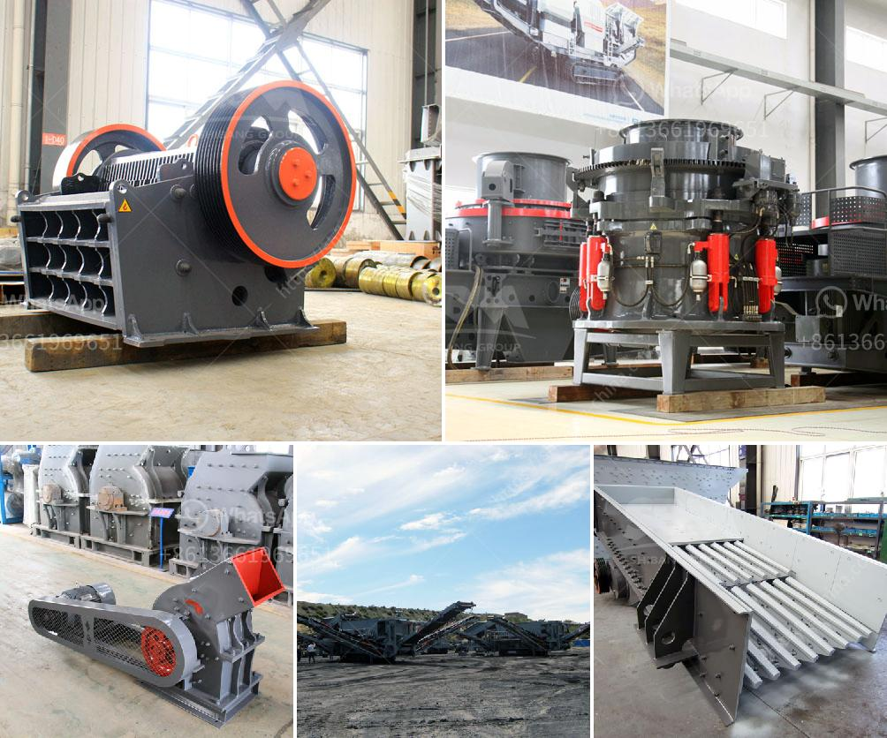

<h3>working hours of a crusher plant</h3>
Crusher plants operate 24 hours a day, seven days a week, 365 days a year, making them essential for any construction project. However, it is not always feasible or desirable to work round the clock. To meet this challenge, crusher plants set specific working hours. In this article, we will explore the reasons behind these working hours and the benefits they offer.

The working hours of a crusher plant are typically divided into shifts. This allows for uninterrupted productivity while providing employees with a balanced work-life schedule. Depending on their agreement, these shifts can vary, but the common ones are the day shift, night shift, and graveyard shift. Each shift usually lasts for eight hours, making a full day of operation at the plant.

One of the primary reasons for setting specific working hours is to ensure noise and environmental regulations compliance. Crusher plants can be noisy due to the operating machinery, including crushers, conveyors, and screens. By limiting the working hours, companies can minimize disruptions to surrounding communities, especially during the night. Noise pollution regulations vary from place to place, but adhering to specific working hours can help avoid unnecessary conflicts with local residents and authorities.

Setting working hours also allows the plant management to plan preventive maintenance, servicing, repairs, and inspections effectively. These activities are essential for the smooth functioning of the machinery, ensuring their efficiency and longevity. By allocating specific periods of time for maintenance, the plant can minimize unplanned downtime and costly repairs. This structured approach enables a proactive strategy where potential issues can be identified and resolved before they escalate.

Moreover, setting working hours helps allocate resources efficiently. A crusher plant requires a workforce and the necessary supplies to operate seamlessly. By organizing working hours, managers can ensure the availability and coordination of personnel, materials, and equipment. This way, each shift receives the appropriate resources required for operations, which in turn enhances productivity and reduces waste of resources.

Besides, setting specific working hours ensures adequate supervision and safety measures. With a designated shift management team overseeing operations, monitoring safety protocols becomes more manageable. Additionally, having a smaller team at work during off-hours limits the number of employees present, reducing the risk of accidents and providing a safer work environment.

The establishment of working hours at crusher plants benefits both the employers and employees. Employees can enjoy a predictable work schedule, making it easier to plan personal activities, attend to family commitments, and maintain a healthy work-life balance. It can also lead to reduced fatigue and enhanced job satisfaction, ultimately increasing productivity. For employers, having well-rested and satisfied employees can result in higher retention rates, lower absenteeism, and improved overall performance.

In conclusion, the working hours of a crusher plant are determined to ensure regulatory compliance, effective maintenance planning, efficient resource allocation, enhanced supervision, and employee satisfaction. By adhering to specific shifts and allocating resources effectively, crusher plants can operate smoothly and efficiently while providing a conducive work environment. These working hours offer benefits to both the company and its employees, ultimately contributing to the success of any construction project.
<h3>Contact us</h3><ul><li><strong>Whatsapp:&nbsp;<a href="https://wa.me/8613661969651">+8613661969651</a></strong></li><li><a href="https://swt.shibang-china.com/?git&amp;zhl&amp;working hours of a crusher plant"><strong>Online Service(chat now)</strong></a></li></ul><h3>Related</h3><ul><li><a href='how to make long lasting talcum powder.md'>how to make long lasting talcum powder</a></li><li><a href='price of stone crusher capacity 200 tons per hour.md'>price of stone crusher capacity 200 tons per hour</a></li><li><a href='rock grinding mill price in india.md'>rock grinding mill price in india</a></li><li><a href='linear vibrating screener nigeria.md'>linear vibrating screener nigeria</a></li><li><a href='hand gold washing plant sale.md'>hand gold washing plant sale</a></li></ul>