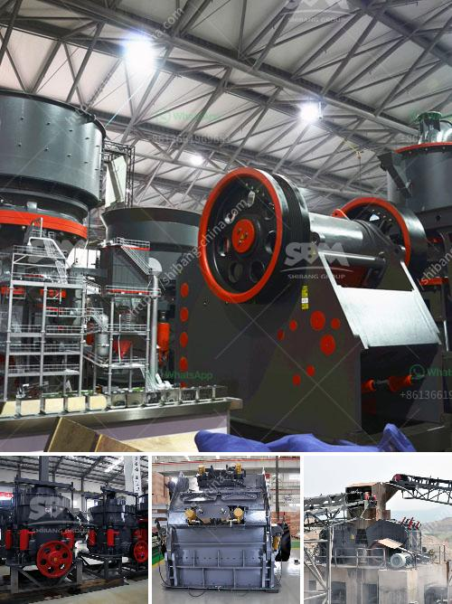

<h3>zimbabwe crusher rental</h3>
In today's fast-paced world, construction projects are rapidly growing in scale and complexity. One critical aspect of any construction project is efficient and effective crushing of materials. For a country like Zimbabwe, with a thriving agricultural and mining industry, the need for reliable crushing equipment is paramount. This is where crusher rental services come to the rescue, offering the ultimate solution for efficient crushing.

Crusher rental services, offered by reputable companies in Zimbabwe, provide customers with the opportunity to rent high-quality crushing equipment for their specific needs. From jaw crushers to cone crushers, from impact crushers to hammer crushers, these rental services offer a wide range of machines that can swiftly and effectively crush various materials such as stones, ores, concrete, and asphalt.

One of the primary advantages of opting for a crusher rental service in Zimbabwe is the cost-effectiveness it offers. Renting crushers allows businesses and contractors to save significant amounts of money compared to purchasing new equipment. Buying new crushers can be a substantial investment, not to mention the additional costs for maintenance, repairs, and transportation. By renting crushers, companies can allocate their capital more efficiently and use the saved cash for other essential aspects of their operations.

Moreover, crusher rental services in Zimbabwe provide flexibility and convenience. Depending on the project requirements, companies can rent crushers for short-term or long-term periods. This flexibility allows businesses to scale their operations according to the project's size and duration, without being tied down to a large financial commitment. The convenience of crusher rental services also extends to the delivery and setup process, as companies providing such services typically handle the transportation, installation, and even training of operators, ensuring a hassle-free experience for customers.

Another significant advantage of crusher rental services is the access to the latest technologies and equipment. Reputable rental companies in Zimbabwe constantly update their fleets of crushers, ensuring that customers have access to state-of-the-art machinery designed for maximum efficiency. By renting equipment, companies can benefit from continuous innovation in the crushing industry, without the need to invest in new equipment every few years.

In addition to cost savings, flexibility, and access to the latest technologies, crusher rental services in Zimbabwe offer reliable maintenance and support. Most rental companies have dedicated teams of professionals who not only provide routine maintenance but also promptly address any breakdowns or repair needs. This eliminates the stress and costs associated with equipment maintenance and repairs, as rental companies take care of all the necessary procedures to keep the crushers in optimal working condition.

To conclude, crusher rental services have become an invaluable resource for companies and contractors in Zimbabwe's construction, agriculture, and mining sectors. Offering cost-effective solutions, flexibility, access to the latest technologies, and reliable maintenance support, these rental services enable businesses to meet their crushing needs efficiently and effectively. So, whether it's for a short-term project or a long-term endeavor, opting for crusher rental services is undoubtedly the ultimate solution for efficient crushing in Zimbabwe.
<h3>Contact us</h3><ul><li><strong>Whatsapp:&nbsp;<a href="https://wa.me/8613661969651">+8613661969651</a></strong></li><li><a href="https://swt.shibang-china.com/?git&amp;zhl&amp;zimbabwe crusher rental"><strong>Online Service(chat now)</strong></a></li></ul><h3>Related</h3><ul><li><a href='stone crusher in himachal pradesh.md'>stone crusher in himachal pradesh</a></li><li><a href='quartz silica old plant sale at telgana.md'>quartz silica old plant sale at telgana</a></li><li><a href='vertical ball mills of india.md'>vertical ball mills of india</a></li><li><a href='gold mining crusher machinery.md'>gold mining crusher machinery</a></li><li><a href='carbonate calcium of ball mill.md'>carbonate calcium of ball mill</a></li></ul>