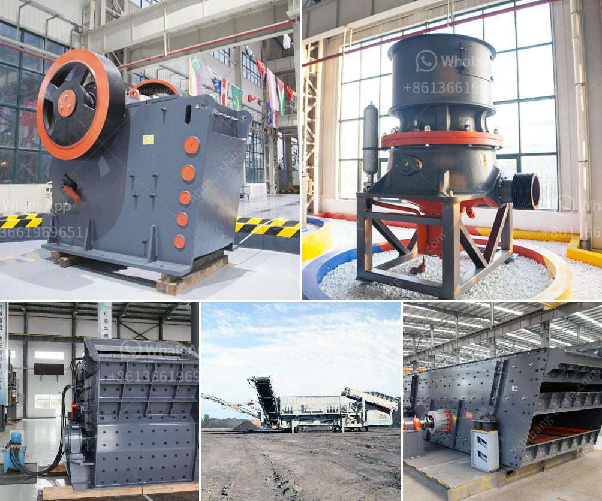

<h3>zinc crusher machine zimbabwe</h3>
Zimbabwe, one of the prominent mining countries in Africa, is known for its rich reserves of various minerals. Among these minerals, zinc, a widely used element in various industries, holds significant importance. The extraction and processing of zinc require advanced machinery, and the zinc crusher machine plays a crucial role in this process.

A zinc crusher machine is used to reduce large-sized rocks into smaller pieces. This machine utilizes the principle of compression to break the rocks into desired sizes. Typically, there are two types of zinc crusher machines available in the market: jaw crushers and impact crushers.

Jaw crushers, also known as primary crushers, are commonly used in mining operations to crush materials into smaller sizes. These machines have a fixed jaw and a movable jaw, both of which work together to compress and crush the rocks. With their high crushing capacity and durability, jaw crushers are highly efficient in the zinc mining industry.

On the other hand, impact crushers utilize the principle of impact to crush rocks. These machines have a rotating rotor fitted with hammers that strike the rocks and break them into smaller pieces. Impact crushers are particularly effective in processing softer materials and are widely used in the mining industry to crush zinc ores.

With the ever-increasing demand for zinc, Zimbabwean mining companies are continuously investing in advanced machinery to enhance their production capacity. The utilization of efficient zinc crusher machines not only increases productivity but also ensures the quality of the final product.

Moreover, the use of modern machines in the mining industry reduces the overall risk of accidents and injuries. These machines are equipped with advanced safety features, providing a safer working environment for the miners.

In conclusion, the zinc crusher machine in Zimbabwe plays a vital role in the mining industry by reducing the size of large rocks and enhancing productivity. The availability of such advanced machinery ensures the efficient extraction and processing of zinc, making Zimbabwe a significant contributor to the global zinc supply.
<h3>Contact us</h3><ul><li><strong>Whatsapp:&nbsp;<a href="https://wa.me/8613661969651">+8613661969651</a></strong></li><li><a href="https://swt.shibang-china.com/?git&amp;zhl&amp;zinc crusher machine zimbabwe"><strong>Online Service(chat now)</strong></a></li></ul><h3>Related</h3><ul><li><a href='dolomite powder producing machinery.md'>dolomite powder producing machinery</a></li><li><a href='picture of silica sand process plant.md'>picture of silica sand process plant</a></li><li><a href='crusher price in philippines.md'>crusher price in philippines</a></li><li><a href='quarry crusher equipment costs.md'>quarry crusher equipment costs</a></li><li><a href='zimbabwe crusher rental.md'>zimbabwe crusher rental</a></li></ul>